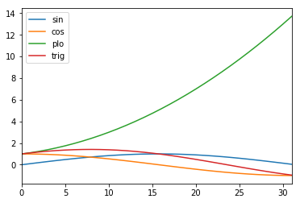

# Fundamental Data Structure :

The fundamental data structure in python includes 

- **Primitive type** ( ***Integer, Float, String***, and ***Boolean***) and 
- **Non-Primitive type** ( ***Array, List, Tuples, Dictionary, Set***, and ***File***) 

In this tutorial, we are going to discudd about List, Tuples, Set and Dictionary. 


### List

List is built in data structure in python. It is 
- Mutable i.e., we can change or edite the size of the list by appending, inserting and deleting the elements.
- List can hold heterogeneous objects (e.g., integer, string, boolean)

Lets try to understand the List:

- To initiate a blank List.


```python
l = []
```

- To find the type of the object.


```python
type(l)
```


    list


- To create a list from scratch.


```python
L = [1,2,3,4,5,6,342,34]
```


```python
L
```


    [1, 2, 3, 4, 5, 6, 342, 34]


- Indexing of list.


```python
L[0],L[1],L[5]
```


    (1, 2, 6)


- Revers indexing is also possible.


```python
L[-1],L[-2],L[-3]
```


    (6, 5, 4)


- To find the length of list.


```python
len(L)
```


    6


- To add the element from last.


```python
L.append(12)
L
```


    [1, 2, 3, 4, 5, 6, 12]


- To find the sum of the elements (if they are of same types like int. double etc)


```python
sum(L)
```


    33


- To find maximum and minimum of the list


```python
max(L), min(L)
```


    (12, 1)


- To create a list of heterogeneous element types.


```python
L = [1,2.0,3,4,5,"Apple",True, False]
```

- To find the type of elements of a list.


```python
type(L[1]),type(L[5])
```


    (float, str)


- To create a list of list.


```python
L = [[1,2,3],[3,4,5],[5,7,9]]
```

- To find list inside a list.


```python
L[0]
```


    [1, 2, 3]


```python
L[0][1]
```


    2


- To add two list. It is not as ususal addition. The elements are accumulated.


```python
L1 = [1,2,3] ; L2 = [2,4,6]
L1+L2, set(L1+L2)
```


    ([1, 2, 3, 2, 4, 6], {1, 2, 3, 4, 6})


- To add element from end of the list


```python
L = [1,4,2,3,5,6,7]
L.append(100)
L
```


    [1, 4, 2, 3, 5, 6, 7, 100]


- To insert element (100) at specific index (1)


```python
L = [1,4,2,3,5,6,7]
L.insert(1,100)
L
```


    [1, 100, 4, 2, 3, 5, 6, 7]


- To remove specific element form list. It will remove the first occurance.


```python
L = [1,4,2,3,5,6,7,4]
L.remove(4)
L
```


    [1, 2, 3, 5, 6, 7, 4]


- To remove the element from specific index


```python
L = [1,4,2,3,5,6,7]
L.pop(-1)
L
```


    [1, 4, 2, 3, 5, 6]


- To sort the list


```python
L = [1,10,2,30,5,60,7]
L.sort()
L
```


    [1, 2, 5, 7, 10, 30, 60]


- To reverse the list


```python
L = [1,4,2,3,5,6,7]
L.reverse()
L
```


    [7, 6, 5, 3, 2, 4, 1]


- List comprehension


```python
L = [x for x in range(100)]
print(L)
```

    [0, 1, 2, 3, 4, 5, 6, 7, 8, 9, 10, 11, 12, 13, 14, 15, 16, 17, 18, 19, 20, 21, 22, 23, 24, 25, 26, 27, 28, 29, 30, 31, 32, 33, 34, 35, 36, 37, 38, 39, 40, 41, 42, 43, 44, 45, 46, 47, 48, 49, 50, 51, 52, 53, 54, 55, 56, 57, 58, 59, 60, 61, 62, 63, 64, 65, 66, 67, 68, 69, 70, 71, 72, 73, 74, 75, 76, 77, 78, 79, 80, 81, 82, 83, 84, 85, 86, 87, 88, 89, 90, 91, 92, 93, 94, 95, 96, 97, 98, 99]


```python
L = [x for x in range(100) if x%2==0]
print(L)
```

    [0, 2, 4, 6, 8, 10, 12, 14, 16, 18, 20, 22, 24, 26, 28, 30, 32, 34, 36, 38, 40, 42, 44, 46, 48, 50, 52, 54, 56, 58, 60, 62, 64, 66, 68, 70, 72, 74, 76, 78, 80, 82, 84, 86, 88, 90, 92, 94, 96, 98]


```python
import random as rn
rn.randint(0,100)
```


    59


```python
import random as rn
R = [rn.randint(0,100) for k in range(200)]
print(R)
```

    [89, 28, 17, 21, 30, 12, 2, 18, 44, 35, 39, 34, 36, 15, 62, 31, 29, 67, 89, 84, 52, 99, 12, 2, 65, 93, 37, 60, 65, 65, 67, 65, 83, 96, 6, 16, 96, 38, 43, 28, 38, 4, 60, 48, 5, 50, 82, 27, 75, 94, 3, 11, 55, 87, 56, 48, 71, 40, 7, 20, 45, 29, 100, 4, 23, 86, 0, 46, 69, 60, 85, 27, 45, 93, 6, 68, 13, 66, 89, 59, 46, 89, 41, 84, 69, 11, 22, 38, 24, 74, 82, 6, 12, 84, 14, 68, 16, 2, 91, 62, 57, 72, 98, 4, 98, 64, 72, 57, 73, 12, 78, 40, 0, 10, 36, 52, 71, 42, 27, 94, 32, 82, 22, 89, 37, 26, 55, 80, 49, 48, 69, 34, 48, 97, 39, 82, 78, 97, 11, 38, 77, 62, 55, 95, 52, 42, 61, 94, 100, 86, 28, 41, 75, 13, 40, 22, 7, 78, 2, 51, 84, 30, 45, 39, 54, 72, 88, 48, 10, 78, 9, 44, 18, 36, 23, 83, 1, 88, 37, 87, 85, 4, 65, 55, 11, 97, 90, 77, 1, 41, 75, 37, 43, 3, 45, 38, 4, 16, 87, 47]


```python
import collections
#High Performance Counting
C = collections.Counter(R)
print(C)
```

    Counter({37: 5, 17: 5, 67: 5, 15: 4, 99: 4, 88: 4, 61: 4, 54: 4, 96: 4, 80: 4, 51: 4, 83: 4, 14: 4, 10: 3, 78: 3, 27: 3, 49: 3, 62: 3, 38: 3, 48: 3, 94: 3, 66: 3, 81: 3, 72: 3, 95: 3, 1: 3, 21: 3, 100: 3, 40: 3, 28: 3, 43: 3, 29: 2, 16: 2, 7: 2, 74: 2, 60: 2, 64: 2, 85: 2, 50: 2, 39: 2, 44: 2, 8: 2, 90: 2, 58: 2, 0: 2, 79: 2, 24: 2, 98: 2, 93: 2, 22: 2, 68: 2, 42: 2, 86: 2, 30: 2, 41: 2, 77: 2, 59: 2, 34: 2, 4: 2, 31: 2, 57: 2, 6: 2, 73: 2, 45: 1, 69: 1, 91: 1, 71: 1, 75: 1, 87: 1, 70: 1, 47: 1, 82: 1, 18: 1, 9: 1, 26: 1, 55: 1, 56: 1, 23: 1, 52: 1, 33: 1, 13: 1, 2: 1, 46: 1, 36: 1, 53: 1, 92: 1, 84: 1, 12: 1, 20: 1, 5: 1})


```python
R = [rn.choice(['A','T','G','C']) for i in range(200)]
print(R)
```

    ['A', 'T', 'C', 'T', 'T', 'C', 'A', 'C', 'G', 'G', 'A', 'T', 'G', 'G', 'C', 'T', 'G', 'C', 'A', 'T', 'A', 'T', 'T', 'G', 'G', 'G', 'A', 'C', 'G', 'G', 'C', 'C', 'A', 'T', 'A', 'A', 'G', 'G', 'G', 'A', 'A', 'G', 'C', 'C', 'A', 'A', 'C', 'G', 'C', 'G', 'T', 'A', 'A', 'A', 'G', 'G', 'T', 'T', 'A', 'G', 'T', 'T', 'G', 'A', 'C', 'G', 'C', 'C', 'G', 'T', 'C', 'T', 'A', 'C', 'G', 'G', 'G', 'T', 'G', 'A', 'A', 'G', 'C', 'T', 'T', 'C', 'C', 'A', 'A', 'G', 'A', 'C', 'G', 'C', 'T', 'T', 'T', 'T', 'A', 'A', 'T', 'C', 'C', 'T', 'G', 'A', 'C', 'G', 'C', 'A', 'G', 'A', 'C', 'C', 'C', 'A', 'G', 'T', 'A', 'G', 'C', 'A', 'G', 'C', 'G', 'G', 'G', 'T', 'T', 'T', 'A', 'A', 'C', 'T', 'G', 'A', 'T', 'A', 'G', 'G', 'G', 'C', 'G', 'T', 'C', 'C', 'T', 'G', 'G', 'C', 'G', 'A', 'G', 'C', 'C', 'A', 'T', 'A', 'T', 'T', 'C', 'A', 'C', 'T', 'G', 'T', 'G', 'T', 'T', 'T', 'C', 'T', 'G', 'C', 'A', 'G', 'G', 'C', 'T', 'T', 'C', 'G', 'C', 'T', 'C', 'G', 'A', 'G', 'T', 'G', 'A', 'C', 'C', 'T', 'A', 'G', 'C', 'T', 'T', 'T']


```python
DNA = ''.join(R)
DNA
```


    'ATCTTCACGGATGGCTGCATATTGGGACGGCCATAAGGGAAGCCAACGCGTAAAGGTTAGTTGACGCCGTCTACGGGTGAAGCTTCCAAGACGCTTTTAATCCTGACGCAGACCCAGTAGCAGCGGGTTTAACTGATAGGGCGTCCTGGCGAGCCATATTCACTGTGTTTCTGCAGGCTTCGCTCGAGTGACCTAGCTTT'


```python
DNA.count('A'), DNA.count('AT'), DNA.count('ATG')
```


    (44, 9, 1)


#### Mini  Assignment:
Create a DNA string of 10,000 characters and count the following: A,T,G,C,all combination of two charaters, all combinations of three characters.


```python

```

### Tuples

Tuples are non-mutable, which means we can ot add or remove elements once tuple is defind.

- To define a tuples from scratch


```python
t = (2,3,4,5)
```

- Find type


```python
type(t)
```


    tuple


- Indexing


```python
t[1]
```


    3


```python
L = [(1,2),(2,3),(3,4)]
```


```python
L[0][0]
```


    1


- Create a list of tuples


```python
L = [(1,2),("a","b"),(True, False)]
L
```


    [(1, 2), ('a', 'b'), (True, False)]


### Dictionary

Dictionary organizes the data with key-value pair. Dictionary can be nested with other data types.

- To initiate a dictionary


```python
D = dict()
DD = {}
```

- Create a dictionary from scratch


```python
D = {"fruit":'apple',
    "vegetable" : 'carrot',
    "rice": 2.0,
    'milk': 10,}
```

- What are keys?


```python
D.keys()
```


    dict_keys(['fruit', 'vegetable', 'rice', 'milk'])


- What are values?


```python
D.values()
```


    dict_values(['apple', 'carrot', 2.0, 10])


- Indexing


```python
D['fruit'], D["rice"]
```


    ('apple', 2.0)


- Iteration over key and values


```python
for key,value in D.items():
    print(key,value)
```

    fruit apple
    vegetable carrot
    rice 2.0
    milk 10


- To update a dictionary


```python
D.update({"salt": 2.0})
D
```


    {'fruit': 'apple', 'vegetable': 'carrot', 'rice': 2.0, 'milk': 10, 'salt': 2.0}


- To create a list form a Dictionary. Only keys are collected.


```python
list(D)
```


    ['fruit', 'vegetable', 'rice', 'milk']


- To create a list of keys only


```python
list(D.keys())
```


    ['fruit', 'vegetable', 'rice', 'milk']


- To create a list of values


```python
list(D.values())
```


    ['apple', 'carrot', 2.0, 10, 2.0]


- To create Dictionary of with list, tuples and dictionary


```python
DD = {"names":("John","Harry", "Brat"),\
      "roll no": [1,2,3],\
      "plan":{"first":[12,34,56],"second":[1,3,5]}}

DD
```


    {'names': ['John', 'Harry', 'Brat'],
     'roll no': (1, 2, 3),
     'plan': {'first': [12, 34, 56], 'second': [1, 3, 5]}}


```python
import numpy as np
X = np.arange(0,np.pi,0.1)
print(X)
```

    [0.  0.1 0.2 0.3 0.4 0.5 0.6 0.7 0.8 0.9 1.  1.1 1.2 1.3 1.4 1.5 1.6 1.7
     1.8 1.9 2.  2.1 2.2 2.3 2.4 2.5 2.6 2.7 2.8 2.9 3.  3.1]


```python
import numpy as np
X = np.arange(0,np.pi,0.1)
M = {"sin": [np.sin(x) for x in X],\
     "cos": [np.cos(x) for x in X],\
     "plo":[(x*x+x+1) for x in X],\
     "trig": [np.cos(x) + np.sin(x) for x in X]}
```


```python
print(M)
```

    {'sin': [0.0, 0.09983341664682815, 0.19866933079506122, 0.2955202066613396, 0.3894183423086505, 0.479425538604203, 0.5646424733950355, 0.6442176872376911, 0.7173560908995228, 0.7833269096274834, 0.8414709848078965, 0.8912073600614354, 0.9320390859672264, 0.963558185417193, 0.9854497299884603, 0.9974949866040544, 0.9995736030415051, 0.9916648104524686, 0.9738476308781951, 0.9463000876874145, 0.9092974268256817, 0.8632093666488737, 0.8084964038195901, 0.74570521217672, 0.6754631805511506, 0.5984721441039564, 0.5155013718214642, 0.4273798802338298, 0.33498815015590466, 0.23924932921398198, 0.1411200080598672, 0.04158066243329049], 'cos': [1.0, 0.9950041652780258, 0.9800665778412416, 0.955336489125606, 0.9210609940028851, 0.8775825618903728, 0.8253356149096782, 0.7648421872844884, 0.6967067093471654, 0.6216099682706644, 0.5403023058681398, 0.4535961214255773, 0.3623577544766734, 0.26749882862458735, 0.16996714290024081, 0.0707372016677029, -0.029199522301288815, -0.12884449429552486, -0.2272020946930871, -0.3232895668635036, -0.4161468365471424, -0.5048461045998576, -0.5885011172553458, -0.6662760212798244, -0.7373937155412458, -0.8011436155469337, -0.8568887533689473, -0.9040721420170612, -0.9422223406686583, -0.9709581651495907, -0.9899924966004454, -0.9991351502732795], 'plo': [1.0, 1.11, 1.24, 1.3900000000000001, 1.56, 1.75, 1.9600000000000002, 2.1900000000000004, 2.4400000000000004, 2.71, 3.0, 3.3100000000000005, 3.6400000000000006, 3.99, 4.36, 4.75, 5.16, 5.590000000000001, 6.04, 6.510000000000001, 7.0, 7.51, 8.040000000000001, 8.590000000000002, 9.160000000000002, 9.75, 10.360000000000001, 10.990000000000002, 11.640000000000002, 12.310000000000002, 13.0, 13.71], 'trig': [1.0, 1.094837581924854, 1.1787359086363027, 1.2508566957869456, 1.3104793363115357, 1.3570081004945758, 1.3899780883047137, 1.4090598745221796, 1.4140628002466882, 1.4049368778981477, 1.3817732906760363, 1.3448034814870127, 1.2943968404438997, 1.2310570140417803, 1.155416872888701, 1.0682321882717574, 0.9703740807402162, 0.8628203161569437, 0.7466455361851081, 0.623010520823911, 0.4931505902785393, 0.35836326204901614, 0.21999528656424427, 0.0794291908968956, -0.061930534990095154, -0.20267147144297726, -0.34138738154748316, -0.47669226178323143, -0.6072341905127536, -0.7317088359356086, -0.8488724885405782, -0.957554487839989]}


```python
import pandas as pd
DF = pd.DataFrame(M)
DF
```


<div>
<style scoped>
    .dataframe tbody tr th:only-of-type {
        vertical-align: middle;
    }

    .dataframe tbody tr th {
        vertical-align: top;
    }

    .dataframe thead th {
        text-align: right;
    }
</style>
<table border="1" class="dataframe">
  <thead>
    <tr style="text-align: right;">
      <th></th>
      <th>sin</th>
      <th>cos</th>
      <th>plo</th>
      <th>trig</th>
    </tr>
  </thead>
  <tbody>
    <tr>
      <th>0</th>
      <td>0.000000</td>
      <td>1.000000</td>
      <td>1.00</td>
      <td>1.000000</td>
    </tr>
    <tr>
      <th>1</th>
      <td>0.099833</td>
      <td>0.995004</td>
      <td>1.11</td>
      <td>1.094838</td>
    </tr>
    <tr>
      <th>2</th>
      <td>0.198669</td>
      <td>0.980067</td>
      <td>1.24</td>
      <td>1.178736</td>
    </tr>
    <tr>
      <th>3</th>
      <td>0.295520</td>
      <td>0.955336</td>
      <td>1.39</td>
      <td>1.250857</td>
    </tr>
    <tr>
      <th>4</th>
      <td>0.389418</td>
      <td>0.921061</td>
      <td>1.56</td>
      <td>1.310479</td>
    </tr>
    <tr>
      <th>5</th>
      <td>0.479426</td>
      <td>0.877583</td>
      <td>1.75</td>
      <td>1.357008</td>
    </tr>
    <tr>
      <th>6</th>
      <td>0.564642</td>
      <td>0.825336</td>
      <td>1.96</td>
      <td>1.389978</td>
    </tr>
    <tr>
      <th>7</th>
      <td>0.644218</td>
      <td>0.764842</td>
      <td>2.19</td>
      <td>1.409060</td>
    </tr>
    <tr>
      <th>8</th>
      <td>0.717356</td>
      <td>0.696707</td>
      <td>2.44</td>
      <td>1.414063</td>
    </tr>
    <tr>
      <th>9</th>
      <td>0.783327</td>
      <td>0.621610</td>
      <td>2.71</td>
      <td>1.404937</td>
    </tr>
    <tr>
      <th>10</th>
      <td>0.841471</td>
      <td>0.540302</td>
      <td>3.00</td>
      <td>1.381773</td>
    </tr>
    <tr>
      <th>11</th>
      <td>0.891207</td>
      <td>0.453596</td>
      <td>3.31</td>
      <td>1.344803</td>
    </tr>
    <tr>
      <th>12</th>
      <td>0.932039</td>
      <td>0.362358</td>
      <td>3.64</td>
      <td>1.294397</td>
    </tr>
    <tr>
      <th>13</th>
      <td>0.963558</td>
      <td>0.267499</td>
      <td>3.99</td>
      <td>1.231057</td>
    </tr>
    <tr>
      <th>14</th>
      <td>0.985450</td>
      <td>0.169967</td>
      <td>4.36</td>
      <td>1.155417</td>
    </tr>
    <tr>
      <th>15</th>
      <td>0.997495</td>
      <td>0.070737</td>
      <td>4.75</td>
      <td>1.068232</td>
    </tr>
    <tr>
      <th>16</th>
      <td>0.999574</td>
      <td>-0.029200</td>
      <td>5.16</td>
      <td>0.970374</td>
    </tr>
    <tr>
      <th>17</th>
      <td>0.991665</td>
      <td>-0.128844</td>
      <td>5.59</td>
      <td>0.862820</td>
    </tr>
    <tr>
      <th>18</th>
      <td>0.973848</td>
      <td>-0.227202</td>
      <td>6.04</td>
      <td>0.746646</td>
    </tr>
    <tr>
      <th>19</th>
      <td>0.946300</td>
      <td>-0.323290</td>
      <td>6.51</td>
      <td>0.623011</td>
    </tr>
    <tr>
      <th>20</th>
      <td>0.909297</td>
      <td>-0.416147</td>
      <td>7.00</td>
      <td>0.493151</td>
    </tr>
    <tr>
      <th>21</th>
      <td>0.863209</td>
      <td>-0.504846</td>
      <td>7.51</td>
      <td>0.358363</td>
    </tr>
    <tr>
      <th>22</th>
      <td>0.808496</td>
      <td>-0.588501</td>
      <td>8.04</td>
      <td>0.219995</td>
    </tr>
    <tr>
      <th>23</th>
      <td>0.745705</td>
      <td>-0.666276</td>
      <td>8.59</td>
      <td>0.079429</td>
    </tr>
    <tr>
      <th>24</th>
      <td>0.675463</td>
      <td>-0.737394</td>
      <td>9.16</td>
      <td>-0.061931</td>
    </tr>
    <tr>
      <th>25</th>
      <td>0.598472</td>
      <td>-0.801144</td>
      <td>9.75</td>
      <td>-0.202671</td>
    </tr>
    <tr>
      <th>26</th>
      <td>0.515501</td>
      <td>-0.856889</td>
      <td>10.36</td>
      <td>-0.341387</td>
    </tr>
    <tr>
      <th>27</th>
      <td>0.427380</td>
      <td>-0.904072</td>
      <td>10.99</td>
      <td>-0.476692</td>
    </tr>
    <tr>
      <th>28</th>
      <td>0.334988</td>
      <td>-0.942222</td>
      <td>11.64</td>
      <td>-0.607234</td>
    </tr>
    <tr>
      <th>29</th>
      <td>0.239249</td>
      <td>-0.970958</td>
      <td>12.31</td>
      <td>-0.731709</td>
    </tr>
    <tr>
      <th>30</th>
      <td>0.141120</td>
      <td>-0.989992</td>
      <td>13.00</td>
      <td>-0.848872</td>
    </tr>
    <tr>
      <th>31</th>
      <td>0.041581</td>
      <td>-0.999135</td>
      <td>13.71</td>
      <td>-0.957554</td>
    </tr>
  </tbody>
</table>
</div>


```python
%matplotlib inline
DF.plot()
```


    <matplotlib.axes._subplots.AxesSubplot at 0x211d87c8668>





### References:
1. https://docs.python.org/3/tutorial/index.html
