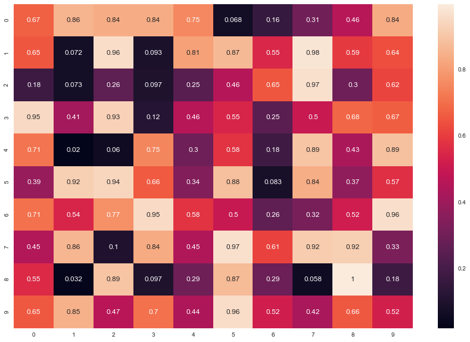
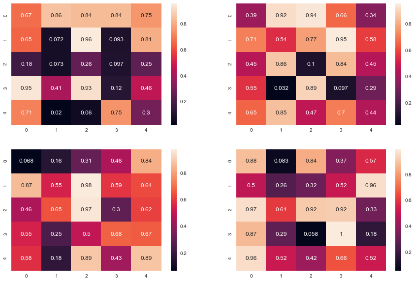
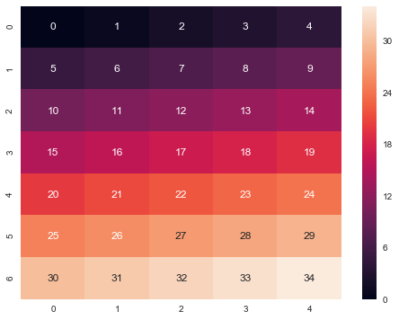
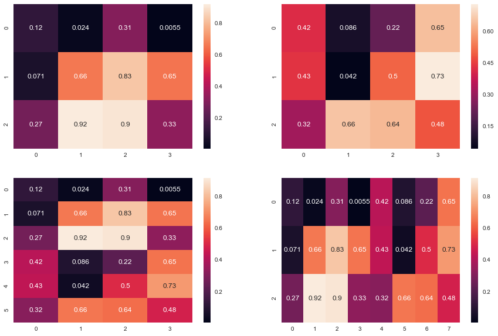

## Numpy tutorial : Array

```numpy.array``` ,   ```numpy.array.shape```,   ```numpy.reshape```, ```numpy.concatenate```

### How to import Numpy library in python


```python
import numpy as np
```

### ***array*** : creating array from list


```python
np.array([1,2,3,4])
```


    array([1, 2, 3, 4])


```python
np.zeros([3,4])
```


    array([[0., 0., 0., 0.],
           [0., 0., 0., 0.],
           [0., 0., 0., 0.]])


```python
np.ones([3,3])
```


    array([[1., 1., 1.],
           [1., 1., 1.],
           [1., 1., 1.]])


#### Creating random matrix of size 10,10


```python
X = np.random.rand(10,10)
X
```


    array([[0.9311515 , 0.67884177, 0.76163691, 0.28748043, 0.06952019,
            0.57756085, 0.94357278, 0.66863999, 0.24938489, 0.99347099],
           [0.76764289, 0.18683651, 0.78127182, 0.8623092 , 0.94597186,
            0.9789824 , 0.85675548, 0.86551995, 0.99206322, 0.15268812],
           [0.981708  , 0.47869981, 0.77828502, 0.76757002, 0.33535944,
            0.53592128, 0.40202929, 0.52178243, 0.15259798, 0.94683227],
           [0.65286918, 0.27848771, 0.32560513, 0.45056069, 0.18100504,
            0.84261218, 0.422149  , 0.21301687, 0.57554343, 0.07971878],
           [0.57691729, 0.16052797, 0.02820894, 0.66050066, 0.56261128,
            0.32582041, 0.87131161, 0.36877167, 0.21222514, 0.47938826],
           [0.32899391, 0.31987521, 0.89478609, 0.90458122, 0.00820214,
            0.96769399, 0.56621307, 0.70947586, 0.64261577, 0.61137201],
           [0.79006349, 0.89937467, 0.46190865, 0.90491822, 0.66487736,
            0.24496253, 0.16261092, 0.31506249, 0.0064727 , 0.42401798],
           [0.99436863, 0.6323061 , 0.4935466 , 0.912547  , 0.38500243,
            0.4960181 , 0.71025453, 0.79576306, 0.03396949, 0.71088413],
           [0.26799206, 0.41849134, 0.72926964, 0.57710126, 0.36234733,
            0.85170595, 0.91298546, 0.8891687 , 0.4984441 , 0.23131008],
           [0.86864829, 0.0859265 , 0.44055358, 0.92151801, 0.65870714,
            0.0021256 , 0.49167628, 0.47508668, 0.48659742, 0.92269232]])


### Visualization of array : Heat map 


```python
import matplotlib.pyplot as plt
import seaborn as sns
sns.set()
```


```python
plt.figure(figsize = [15,10])
sns.heatmap(X, annot=True)
```


    <matplotlib.axes._subplots.AxesSubplot at 0x7f3dcc89b9b0>





###  Find subarray : splitting to 4 subarrays


```python
plt.figure(figsize = [15,10])
plt.subplot(2,2,1)
sns.heatmap(X[0:5,0:5], annot=True)
plt.subplot(2,2,2)
sns.heatmap(X[5:10,0:5], annot=True)
plt.subplot(2,2,3)
sns.heatmap(X[0:5,5:10], annot=True)
plt.subplot(2,2,4)
sns.heatmap(X[5:10,5:10], annot=True)
plt.show()
```





### Change shape of array:  from [10 by 10] to [20 by 5]


```python
X.shape = (20,5)
X
```


    array([[0.3188929 , 0.6959524 , 0.73093736, 0.43628291, 0.49014931],
           [0.67804229, 0.26945929, 0.6787637 , 0.49544915, 0.28129553],
           [0.75672154, 0.09647321, 0.46344621, 0.57988862, 0.0843775 ],
           [0.21978525, 0.99238676, 0.80045437, 0.83230711, 0.1300036 ],
           [0.18533263, 0.85867317, 0.4496527 , 0.72355778, 0.97670987],
           [0.03893615, 0.41116845, 0.61798222, 0.67051191, 0.53543659],
           [0.95259274, 0.14566815, 0.74642352, 0.92240214, 0.02270644],
           [0.82583077, 0.22513541, 0.68126091, 0.80503395, 0.20994175],
           [0.5572094 , 0.61159805, 0.23046078, 0.9423228 , 0.34073382],
           [0.55237701, 0.56379448, 0.99317082, 0.27824713, 0.75344767],
           [0.90546342, 0.3534449 , 0.83919252, 0.03603223, 0.56586636],
           [0.54411187, 0.10881733, 0.29566636, 0.49793917, 0.66915791],
           [0.23681423, 0.23852226, 0.84623021, 0.2428092 , 0.04609895],
           [0.42833986, 0.05091374, 0.69665706, 0.29589828, 0.52183274],
           [0.03402203, 0.23676124, 0.87017633, 0.3862823 , 0.48184487],
           [0.2613791 , 0.52247716, 0.98673513, 0.35632249, 0.62492285],
           [0.3047382 , 0.6577787 , 0.10553745, 0.37968368, 0.45684338],
           [0.86127512, 0.72617042, 0.79811008, 0.71744026, 0.01710278],
           [0.97486086, 0.3659719 , 0.68581511, 0.85199672, 0.15147913],
           [0.38602888, 0.60889842, 0.43274503, 0.49652464, 0.55742177]])


```python
plt.figure(figsize = [15,10])
sns.heatmap(X, annot=True)
```


    <matplotlib.axes._subplots.AxesSubplot at 0x7f3dccc2e4a8>


### Reshaping the Array


```python
X = np.arange(35)
X
```


    array([ 0,  1,  2,  3,  4,  5,  6,  7,  8,  9, 10, 11, 12, 13, 14, 15, 16,
           17, 18, 19, 20, 21, 22, 23, 24, 25, 26, 27, 28, 29, 30, 31, 32, 33,
           34])


```python
XX = np.reshape(X, (7, 5))
```


```python
plt.figure(figsize = [8,6])
sns.heatmap(XX, annot=True)
```


    <matplotlib.axes._subplots.AxesSubplot at 0x7f3dcca794e0>





###  Flatten the Array


```python
X = np.random.rand(4,5)
X.shape
```


    (4, 5)


```python
X
```


    array([[0.46425663, 0.26273357, 0.76715497, 0.02803551, 0.06077554],
           [0.45085724, 0.20021709, 0.83866571, 0.93010498, 0.82287586],
           [0.64015274, 0.40214994, 0.46140888, 0.10875569, 0.90314464],
           [0.1996534 , 0.00575243, 0.19888495, 0.80968552, 0.66819322]])


```python
Y = X.flatten()
Y.shape
```


    (20,)


```python
Y
```


    array([0.46425663, 0.26273357, 0.76715497, 0.02803551, 0.06077554,
           0.45085724, 0.20021709, 0.83866571, 0.93010498, 0.82287586,
           0.64015274, 0.40214994, 0.46140888, 0.10875569, 0.90314464,
           0.1996534 , 0.00575243, 0.19888495, 0.80968552, 0.66819322])


###  Concatenate the Array


```python
A = np.random.rand(3,4)
B = np.random.rand(3,4)
```

#### Verticle addition


```python
C = np.concatenate((A,B),axis =0)
```

#### Horizontal Addition


```python
D = np.concatenate((A,B),axis =1)
```

#### Array Disply


```python
plt.figure(figsize = [15,10])
plt.subplot(2,2,1)
sns.heatmap(A, annot=True)
plt.subplot(2,2,2)
sns.heatmap(B, annot=True)
plt.subplot(2,2,3)
sns.heatmap(C, annot=True)
plt.subplot(2,2,4)
sns.heatmap(D, annot=True)
plt.show()
```





###  Row sum and column sum


```python
X = np.random.rand(8,6)
```

##### sum of all elements


```python
X.sum()
```


    24.566949569026413


#### Row sum


```python
np.sum(X,axis =1)
```


    array([4.20288936, 2.3996539 , 2.46388761, 4.30291271, 2.60671914,
           2.23461285, 2.68832592, 3.6679481 ])


#### Column sum


```python
np.sum(X,axis =0)
```


    array([3.69453055, 3.84555591, 5.87500707, 2.90605569, 4.41441644,
           3.83138392])


