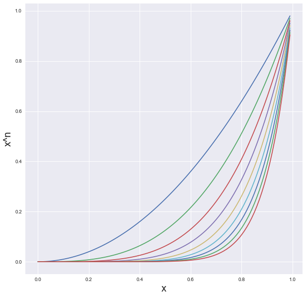
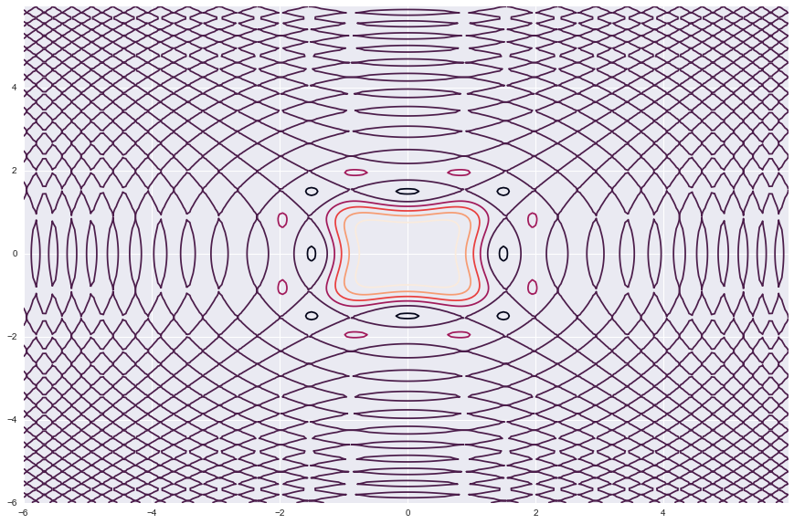
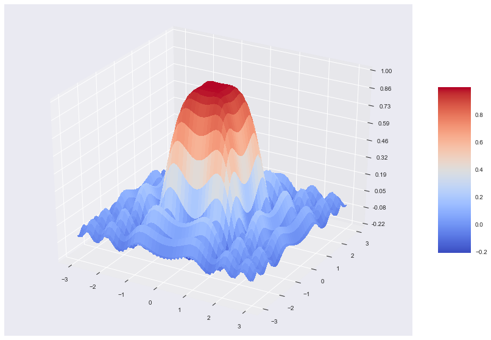
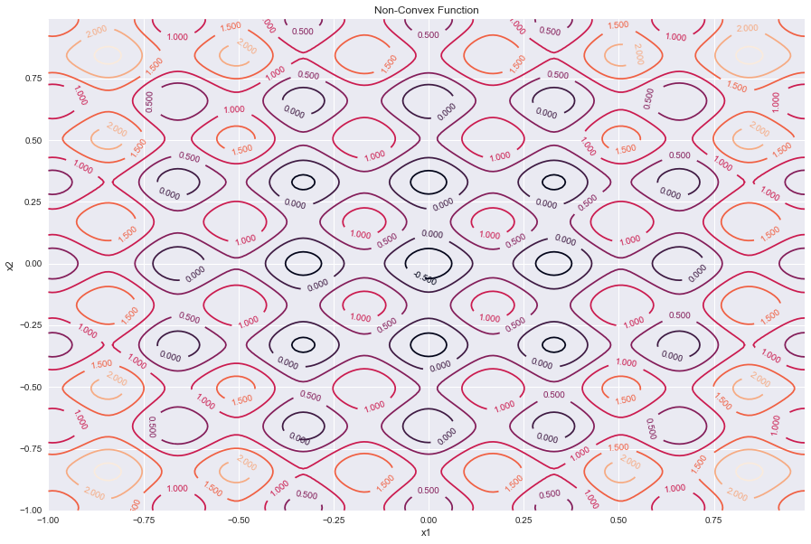
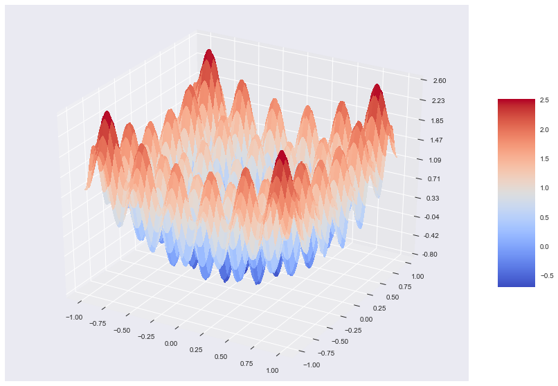

## Numpy tutorial : ```arange```,```meshgrid```

#### How to import Numpy library in python


```python
import numpy as np
```

### 1. ***arange*** : How to generate integers from n1 to n2


```python
X = np.arange(10)
X
```


    array([0, 1, 2, 3, 4, 5, 6, 7, 8, 9])


```python
X*X
```


    array([ 0,  1,  4,  9, 16, 25, 36, 49, 64, 81])


```python
np.arange(3,12)
```


    array([ 3,  4,  5,  6,  7,  8,  9, 10, 11])


```python
np.arange(1,10,2)
```


    array([1, 3, 5, 7, 9])


```python
np.arange(10,11,0.01)
```


    array([10.  , 10.01, 10.02, 10.03, 10.04, 10.05, 10.06, 10.07, 10.08,
           10.09, 10.1 , 10.11, 10.12, 10.13, 10.14, 10.15, 10.16, 10.17,
           10.18, 10.19, 10.2 , 10.21, 10.22, 10.23, 10.24, 10.25, 10.26,
           10.27, 10.28, 10.29, 10.3 , 10.31, 10.32, 10.33, 10.34, 10.35,
           10.36, 10.37, 10.38, 10.39, 10.4 , 10.41, 10.42, 10.43, 10.44,
           10.45, 10.46, 10.47, 10.48, 10.49, 10.5 , 10.51, 10.52, 10.53,
           10.54, 10.55, 10.56, 10.57, 10.58, 10.59, 10.6 , 10.61, 10.62,
           10.63, 10.64, 10.65, 10.66, 10.67, 10.68, 10.69, 10.7 , 10.71,
           10.72, 10.73, 10.74, 10.75, 10.76, 10.77, 10.78, 10.79, 10.8 ,
           10.81, 10.82, 10.83, 10.84, 10.85, 10.86, 10.87, 10.88, 10.89,
           10.9 , 10.91, 10.92, 10.93, 10.94, 10.95, 10.96, 10.97, 10.98,
           10.99])


#### 1.1 Application


```python
import matplotlib.pyplot as plt
import seaborn as sns
%matplotlib inline
sns.set()
```


```python
x = np.arange(0,1,0.01)
plt.figure(figsize = [10,10])

plt.plot(x,x**2,\
         x,x**3,\
         x,x**4,\
         x,x**5,\
         x,x**6,\
         x,x**7,\
         x,x**8,\
         x,x**9,\
         x,x**10)

plt.grid(True)

plt.xlabel('x',fontsize =20)
plt.ylabel('x^n',fontsize =20)
plt.show()
```





#### Creating Numpy array


```python
data_array = np.array([x,x**2,x**3,x**4,x**5,x**6,x**7,x**8,x**9,x**10])
```


```python
data_array[0:5,0:5]
```


    array([[0.000e+00, 1.000e-02, 2.000e-02, 3.000e-02, 4.000e-02],
           [0.000e+00, 1.000e-04, 4.000e-04, 9.000e-04, 1.600e-03],
           [0.000e+00, 1.000e-06, 8.000e-06, 2.700e-05, 6.400e-05],
           [0.000e+00, 1.000e-08, 1.600e-07, 8.100e-07, 2.560e-06],
           [0.000e+00, 1.000e-10, 3.200e-09, 2.430e-08, 1.024e-07]])


```python
data_array.shape
```


    (10, 100)


-------------

### 2. ***meshgrid*** :  How to create a grid and it's application to ploting cost functions

-------------


```python
x = np.arange(-6,6,0.05)
y = np.arange(-6,6,0.05)
grid = np.meshgrid(x,y)
```

##### 1. Example Cost function

$\large{Z = \frac{sin(x^2+y^2).cos(x^2-y^2)}{x^2+y^2}}$


```python
xx, yy = np.meshgrid(x, y, sparse=True)  #   <---------------------------------------------

z = np.sin(xx**2 + yy**2)*np.cos(xx**2 - yy**2) / (xx**2 + yy**2)
plt.figure(figsize = [15,10])
h = plt.contour(x,y,z)
# Label contours
plt.clabel(CS, inline=1, fontsize=10)
```


    <a list of 147 text.Text objects>





```python
from mpl_toolkits.mplot3d import Axes3D
import matplotlib.pyplot as plt
from matplotlib import cm
from matplotlib.ticker import LinearLocator, FormatStrFormatter
import numpy as np


fig = plt.figure(figsize = [15,10])
ax = fig.gca(projection='3d')

# Make data.
x = np.arange(-3, 3, 0.01)
y = np.arange(-3, 3, 0.01)

xx, yy = np.meshgrid(x, y) #  <-------------------------------


z = np.sin(xx**2 + yy**2)*np.cos(xx**2 - yy**2) / (xx**2 + yy**2)

# Plot the surface.
surf = ax.plot_surface(xx, yy, z, cmap=cm.coolwarm,linewidth=0, antialiased=False)

# Customize the z axis.
#ax.set_zlim(-1.01, 1.01)
ax.zaxis.set_major_locator(LinearLocator(10))
ax.zaxis.set_major_formatter(FormatStrFormatter('%.02f'))

# Add a color bar which maps values to colors.
fig.colorbar(surf, shrink=0.5, aspect=5)

plt.show()
```





------------

##### Example 2: Simulated annealing


```python
import math as math
```

$\large{Z =  0.2 + x^2 + y^2 -0.1 \cos(6 \pi x) - 0.1\cos(6 \pi y)}$


```python
# Design variables at mesh points
x = np.arange(-1.0, 1.0, 0.01)
y = np.arange(-1.0, 1.0, 0.01)

xx, yy = np.meshgrid(x, y) #<-----------------------------


z =  0.2 + xx**2 + yy**2\
       - 0.5*np.cos(6.0*math.pi*xx)\
       - 0.5*np.cos(6.0*math.pi*yy)


# Create a contour plot
plt.figure(figsize =[15,10])
CS = plt.contour(xx, yy, z)

# Label contours
plt.clabel(CS, inline=1, fontsize=10)


plt.title('Non-Convex Function')
plt.xlabel('x1')
plt.ylabel('x2')

```


    Text(0,0.5,'x2')





```python
from mpl_toolkits.mplot3d import Axes3D
import matplotlib.pyplot as plt
from matplotlib import cm
from matplotlib.ticker import LinearLocator, FormatStrFormatter
import numpy as np


fig = plt.figure(figsize = [15,10])
ax = fig.gca(projection='3d')

# Make data.
x = np.arange(-1, 1, 0.01)
y = np.arange(-1, 1, 0.01)

xx, yy = np.meshgrid(x, y) #  <-------------------------------


z = 0.2 + xx**2 + yy**2\
       - 0.5*np.cos(6.0*math.pi*xx)\
       - 0.5*np.cos(6.0*math.pi*yy)


# Plot the surface.
surf = ax.plot_surface(xx, yy, z, cmap=cm.coolwarm,linewidth=0, antialiased=False)

# Customize the z axis.
#ax.set_zlim(-1.01, 1.01)
ax.zaxis.set_major_locator(LinearLocator(10))
ax.zaxis.set_major_formatter(FormatStrFormatter('%.02f'))

# Add a color bar which maps values to colors.
fig.colorbar(surf, shrink=0.5, aspect=5)

plt.show()
```




