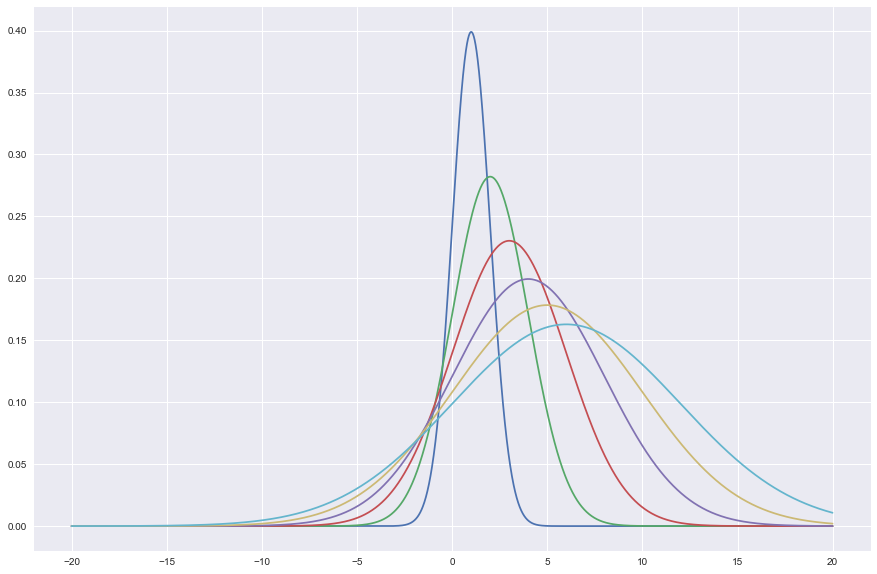

# Numpy Tutorial: Sattistics


```python
import numpy as np
```


```python
A = np.random.rand(10,10)
A
```


    array([[ 0.14686345,  0.4890597 ,  0.95867873,  0.70684257,  0.4571942 ,
             0.88999371,  0.94088925,  0.39260288,  0.63593196,  0.91229658],
           [ 0.48868386,  0.12750921,  0.53490442,  0.85215575,  0.68973691,
             0.86751533,  0.10078796,  0.570043  ,  0.57702153,  0.82067194],
           [ 0.36724515,  0.44952882,  0.14455048,  0.92813935,  0.82722792,
             0.15527858,  0.72646211,  0.78073294,  0.07039077,  0.02742469],
           [ 0.93215519,  0.78939341,  0.05433345,  0.63077664,  0.12257019,
             0.38620259,  0.50937441,  0.5286639 ,  0.13651584,  0.08476626],
           [ 0.02843688,  0.87159643,  0.58489852,  0.51735115,  0.5759214 ,
             0.74431949,  0.55435673,  0.28474752,  0.77936953,  0.39612921],
           [ 0.73733762,  0.90077575,  0.86999616,  0.69950308,  0.68703817,
             0.5340441 ,  0.42895176,  0.99739758,  0.05244868,  0.30736319],
           [ 0.43320514,  0.29546614,  0.70165549,  0.07203503,  0.58150789,
             0.64377815,  0.4401386 ,  0.14734496,  0.43707321,  0.7376671 ],
           [ 0.32679964,  0.39911744,  0.82063392,  0.42401808,  0.95892193,
             0.72902086,  0.90609457,  0.66556375,  0.00359741,  0.51747374],
           [ 0.8956028 ,  0.32121392,  0.77467549,  0.53642615,  0.85494789,
             0.56736366,  0.54043267,  0.26757794,  0.68840931,  0.47665347],
           [ 0.13547503,  0.36567291,  0.28543209,  0.91452908,  0.57162599,
             0.34107302,  0.14420041,  0.87902944,  0.68964655,  0.42688096]])


```python
A.shape
```


    (10, 10)


```python
A.max()
```


    0.9973975789240529


```python
A.min()
```


    0.0035974071135107533


```python
A.mean()
```


    0.53281080467131514


```python
np.median(A)
```


    0.53842941044090042


```python
A.std()
```


    0.30117722286159915


#### Mean and std of row


```python
np.mean(A,axis =0)
```


    array([ 0.39053118,  0.38187714,  0.45877901,  0.61380263,  0.64927112,
            0.46921661,  0.60222378,  0.50624244,  0.27490776,  0.54313828])


```python
np.std(A,axis =0)
```


    array([ 0.32438441,  0.29543643,  0.35045695,  0.27228791,  0.2178827 ,
            0.26696293,  0.32834441,  0.1804856 ,  0.18123375,  0.31624931])


#### Mean and std of col


```python
np.mean(A,axis =1)
```


    array([ 0.24116424,  0.48699354,  0.4219599 ,  0.43972281,  0.47657735,
            0.57537948,  0.55289209,  0.66313705,  0.46013377,  0.57202973])


```python
np.std(A,axis = 1)
```


    array([ 0.19852809,  0.33144078,  0.28219183,  0.27736838,  0.22851456,
            0.33649951,  0.31209182,  0.20212544,  0.27845001,  0.31922731])


---------

### Standard scalar :  feature scaling


```python
A_ss = A - A.min()/A.max()-A.min()
```


```python
A_ss
```


    array([[  4.10527053e-01,   7.54472423e-01,   7.94834247e-01,
              7.30222536e-01,   2.05492062e-01,   7.26892063e-01,
              7.31928243e-01,   5.75438370e-01,   5.93092716e-01,
              3.64078100e-01],
           [  6.91227074e-01,   3.26851066e-01,   6.93898234e-01,
              5.00701344e-02,   7.09305332e-01,   8.38725771e-02,
              7.42069173e-03,   7.35359172e-01,   2.95379821e-01,
              6.85238478e-01],
           [  7.79833365e-01,   7.41786430e-01,   3.19212366e-01,
              6.81133292e-01,   8.84713319e-01,   6.79371426e-01,
              5.60580679e-01,   1.38029784e-01,   8.13389121e-02,
              8.39869709e-01],
           [  4.95468619e-01,   8.24202013e-01,  -5.68858232e-04,
              4.31268827e-01,   3.38998416e-01,   9.81193130e-01,
              4.35576371e-01,   6.44445825e-02,   4.62408333e-02,
              6.89168348e-01],
           [  4.83093638e-01,   4.35554299e-01,   8.99866132e-01,
              9.27827109e-01,   2.75868637e-01,   2.11364337e-01,
              5.98421053e-01,   4.63481490e-01,   5.65166049e-01,
              4.00957652e-01],
           [  6.48396649e-01,   8.91158478e-01,   2.62023883e-01,
              4.97729268e-01,   4.86885273e-01,   1.39092208e-01,
              3.41289269e-01,   3.48342574e-01,   4.56935240e-01,
              4.67606744e-01],
           [  2.80349932e-01,   6.49334474e-01,   6.69037668e-01,
              5.85372776e-01,   7.04975765e-01,   8.00871254e-01,
              5.35627470e-01,   9.70136155e-01,   1.16631608e-01,
              2.79515900e-01],
           [  9.08763495e-01,   3.00196542e-02,   5.99466774e-02,
              6.81881968e-01,   7.96816096e-01,   2.63795132e-01,
              9.82016613e-02,   8.91612556e-01,   4.33903568e-01,
              1.27023490e-02],
           [  2.62261736e-01,  -4.47661111e-03,   4.01181988e-01,
              6.78168605e-01,   9.14777758e-01,   7.66458761e-01,
              1.03201876e-01,   9.73263369e-01,   5.80404084e-01,
              1.51452341e-01],
           [  5.09890394e-01,   6.55040004e-01,   1.14783059e-01,
              1.22995637e-02,   2.48635616e-01,   8.57963655e-01,
              9.79050239e-01,   7.73205705e-01,   8.14437099e-01,
              2.42875670e-01]])


-------

### Normalization :  sample Normalization


```python
B = np.random.rand(5,5)
```


```python
Bn = B-B.mean()/B.std()
```


```python
Bn
```


    array([[-1.50414377, -1.87642236, -1.57282944, -1.72966009, -1.87154951],
           [-1.55166607, -1.52753634, -1.52791948, -1.46539342, -1.37820295],
           [-1.93716316, -1.53215212, -1.40664146, -1.72826488, -1.89673994],
           [-1.45251097, -1.46672865, -1.58718485, -1.3702699 , -1.17691599],
           [-1.98244464, -1.73232164, -1.75732137, -1.74607803, -1.64767919]])


------

### Normal Distribution


```python
x = np.arange(-20,20,0.01)
```


```python
import matplotlib.pyplot as plt
%matplotlib inline
import seaborn as sns
import math as math
sns.set()
```

$$f(x,\mu,\sigma^{2}) = \frac{1}{\sqrt{2\pi\sigma^{2}}} e ^{\frac{-(x-\mu)^{2}}{2\sigma^{2}}}$$


```python
def normal(x,m,s):
    f = (1/np.sqrt(2*np.pi*s))*np.exp(-(x-m)**2/(2*s**2))
    return f
```


```python
plt.figure(figsize = [15,10])
plt.plot(x,normal(x,1.0,1.0),\
        x,normal(x,2.0,2.0),\
        x,normal(x,3.0,3.0),\
        x,normal(x,4.0,4.0),\
        x,normal(x,5.0,5.0),\
        x,normal(x,6.0,6.0))
plt.show()
```




