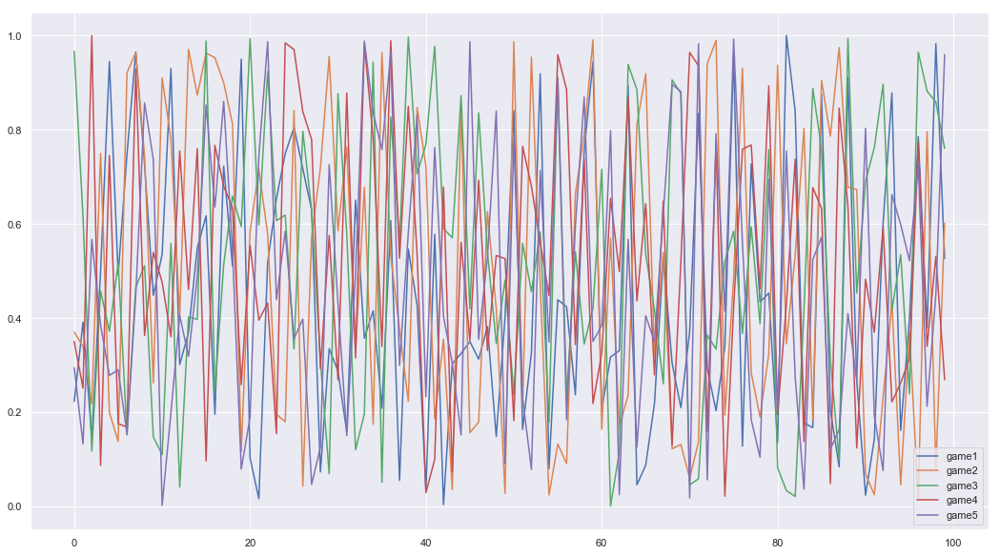

# Data View with Titanic dataset

-------------


```python
import pandas as pd
import numpy as np
import seaborn as sns
import matplotlib.pyplot as plt
%matplotlib inline
sns.set()
```

##   Load data

---------


```python
titanic = pd.read_csv('data/titanic.csv')
```


```python
titanic.head(10)
```


<div>
<style scoped>
    .dataframe tbody tr th:only-of-type {
        vertical-align: middle;
    }

    .dataframe tbody tr th {
        vertical-align: top;
    }

    .dataframe thead th {
        text-align: right;
    }
</style>
<table border="1" class="dataframe">
  <thead>
    <tr style="text-align: right;">
      <th></th>
      <th>PassengerId</th>
      <th>Survived</th>
      <th>Pclass</th>
      <th>Name</th>
      <th>Sex</th>
      <th>Age</th>
      <th>SibSp</th>
      <th>Parch</th>
      <th>Ticket</th>
      <th>Fare</th>
      <th>Cabin</th>
      <th>Embarked</th>
    </tr>
  </thead>
  <tbody>
    <tr>
      <th>0</th>
      <td>1</td>
      <td>0</td>
      <td>3</td>
      <td>Braund, Mr. Owen Harris</td>
      <td>male</td>
      <td>22.0</td>
      <td>1</td>
      <td>0</td>
      <td>A/5 21171</td>
      <td>7.2500</td>
      <td>NaN</td>
      <td>S</td>
    </tr>
    <tr>
      <th>1</th>
      <td>2</td>
      <td>1</td>
      <td>1</td>
      <td>Cumings, Mrs. John Bradley (Florence Briggs Th...</td>
      <td>female</td>
      <td>38.0</td>
      <td>1</td>
      <td>0</td>
      <td>PC 17599</td>
      <td>71.2833</td>
      <td>C85</td>
      <td>C</td>
    </tr>
    <tr>
      <th>2</th>
      <td>3</td>
      <td>1</td>
      <td>3</td>
      <td>Heikkinen, Miss. Laina</td>
      <td>female</td>
      <td>26.0</td>
      <td>0</td>
      <td>0</td>
      <td>STON/O2. 3101282</td>
      <td>7.9250</td>
      <td>NaN</td>
      <td>S</td>
    </tr>
    <tr>
      <th>3</th>
      <td>4</td>
      <td>1</td>
      <td>1</td>
      <td>Futrelle, Mrs. Jacques Heath (Lily May Peel)</td>
      <td>female</td>
      <td>35.0</td>
      <td>1</td>
      <td>0</td>
      <td>113803</td>
      <td>53.1000</td>
      <td>C123</td>
      <td>S</td>
    </tr>
    <tr>
      <th>4</th>
      <td>5</td>
      <td>0</td>
      <td>3</td>
      <td>Allen, Mr. William Henry</td>
      <td>male</td>
      <td>35.0</td>
      <td>0</td>
      <td>0</td>
      <td>373450</td>
      <td>8.0500</td>
      <td>NaN</td>
      <td>S</td>
    </tr>
    <tr>
      <th>5</th>
      <td>6</td>
      <td>0</td>
      <td>3</td>
      <td>Moran, Mr. James</td>
      <td>male</td>
      <td>NaN</td>
      <td>0</td>
      <td>0</td>
      <td>330877</td>
      <td>8.4583</td>
      <td>NaN</td>
      <td>Q</td>
    </tr>
    <tr>
      <th>6</th>
      <td>7</td>
      <td>0</td>
      <td>1</td>
      <td>McCarthy, Mr. Timothy J</td>
      <td>male</td>
      <td>54.0</td>
      <td>0</td>
      <td>0</td>
      <td>17463</td>
      <td>51.8625</td>
      <td>E46</td>
      <td>S</td>
    </tr>
    <tr>
      <th>7</th>
      <td>8</td>
      <td>0</td>
      <td>3</td>
      <td>Palsson, Master. Gosta Leonard</td>
      <td>male</td>
      <td>2.0</td>
      <td>3</td>
      <td>1</td>
      <td>349909</td>
      <td>21.0750</td>
      <td>NaN</td>
      <td>S</td>
    </tr>
    <tr>
      <th>8</th>
      <td>9</td>
      <td>1</td>
      <td>3</td>
      <td>Johnson, Mrs. Oscar W (Elisabeth Vilhelmina Berg)</td>
      <td>female</td>
      <td>27.0</td>
      <td>0</td>
      <td>2</td>
      <td>347742</td>
      <td>11.1333</td>
      <td>NaN</td>
      <td>S</td>
    </tr>
    <tr>
      <th>9</th>
      <td>10</td>
      <td>1</td>
      <td>2</td>
      <td>Nasser, Mrs. Nicholas (Adele Achem)</td>
      <td>female</td>
      <td>14.0</td>
      <td>1</td>
      <td>0</td>
      <td>237736</td>
      <td>30.0708</td>
      <td>NaN</td>
      <td>C</td>
    </tr>
  </tbody>
</table>
</div>


```python
titanic.shape
```


    (891, 12)


```python
titanic.columns
```


    Index(['PassengerId', 'Survived', 'Pclass', 'Name', 'Sex', 'Age', 'SibSp',
           'Parch', 'Ticket', 'Fare', 'Cabin', 'Embarked'],
          dtype='object')


```python
titanic.index
```


    RangeIndex(start=0, stop=891, step=1)


### Preliminary Satatistics


```python
titanic.describe()
```


<div>
<style scoped>
    .dataframe tbody tr th:only-of-type {
        vertical-align: middle;
    }

    .dataframe tbody tr th {
        vertical-align: top;
    }

    .dataframe thead th {
        text-align: right;
    }
</style>
<table border="1" class="dataframe">
  <thead>
    <tr style="text-align: right;">
      <th></th>
      <th>PassengerId</th>
      <th>Survived</th>
      <th>Pclass</th>
      <th>Age</th>
      <th>SibSp</th>
      <th>Parch</th>
      <th>Fare</th>
    </tr>
  </thead>
  <tbody>
    <tr>
      <th>count</th>
      <td>891.000000</td>
      <td>891.000000</td>
      <td>891.000000</td>
      <td>714.000000</td>
      <td>891.000000</td>
      <td>891.000000</td>
      <td>891.000000</td>
    </tr>
    <tr>
      <th>mean</th>
      <td>446.000000</td>
      <td>0.383838</td>
      <td>2.308642</td>
      <td>29.699118</td>
      <td>0.523008</td>
      <td>0.381594</td>
      <td>32.204208</td>
    </tr>
    <tr>
      <th>std</th>
      <td>257.353842</td>
      <td>0.486592</td>
      <td>0.836071</td>
      <td>14.526497</td>
      <td>1.102743</td>
      <td>0.806057</td>
      <td>49.693429</td>
    </tr>
    <tr>
      <th>min</th>
      <td>1.000000</td>
      <td>0.000000</td>
      <td>1.000000</td>
      <td>0.420000</td>
      <td>0.000000</td>
      <td>0.000000</td>
      <td>0.000000</td>
    </tr>
    <tr>
      <th>25%</th>
      <td>223.500000</td>
      <td>0.000000</td>
      <td>2.000000</td>
      <td>20.125000</td>
      <td>0.000000</td>
      <td>0.000000</td>
      <td>7.910400</td>
    </tr>
    <tr>
      <th>50%</th>
      <td>446.000000</td>
      <td>0.000000</td>
      <td>3.000000</td>
      <td>28.000000</td>
      <td>0.000000</td>
      <td>0.000000</td>
      <td>14.454200</td>
    </tr>
    <tr>
      <th>75%</th>
      <td>668.500000</td>
      <td>1.000000</td>
      <td>3.000000</td>
      <td>38.000000</td>
      <td>1.000000</td>
      <td>0.000000</td>
      <td>31.000000</td>
    </tr>
    <tr>
      <th>max</th>
      <td>891.000000</td>
      <td>1.000000</td>
      <td>3.000000</td>
      <td>80.000000</td>
      <td>8.000000</td>
      <td>6.000000</td>
      <td>512.329200</td>
    </tr>
  </tbody>
</table>
</div>


-----------------

### Setting Name column as index


```python
titanic_df1 = titanic.copy(deep =True)
```


```python
titanic_df1 = titanic.set_index('Name')
titanic_df1.head(2)
```


<div>
<style scoped>
    .dataframe tbody tr th:only-of-type {
        vertical-align: middle;
    }

    .dataframe tbody tr th {
        vertical-align: top;
    }

    .dataframe thead th {
        text-align: right;
    }
</style>
<table border="1" class="dataframe">
  <thead>
    <tr style="text-align: right;">
      <th></th>
      <th>PassengerId</th>
      <th>Survived</th>
      <th>Pclass</th>
      <th>Sex</th>
      <th>Age</th>
      <th>SibSp</th>
      <th>Parch</th>
      <th>Ticket</th>
      <th>Fare</th>
      <th>Cabin</th>
      <th>Embarked</th>
    </tr>
    <tr>
      <th>Name</th>
      <th></th>
      <th></th>
      <th></th>
      <th></th>
      <th></th>
      <th></th>
      <th></th>
      <th></th>
      <th></th>
      <th></th>
      <th></th>
    </tr>
  </thead>
  <tbody>
    <tr>
      <th>Braund, Mr. Owen Harris</th>
      <td>1</td>
      <td>0</td>
      <td>3</td>
      <td>male</td>
      <td>22.0</td>
      <td>1</td>
      <td>0</td>
      <td>A/5 21171</td>
      <td>7.2500</td>
      <td>NaN</td>
      <td>S</td>
    </tr>
    <tr>
      <th>Cumings, Mrs. John Bradley (Florence Briggs Thayer)</th>
      <td>2</td>
      <td>1</td>
      <td>1</td>
      <td>female</td>
      <td>38.0</td>
      <td>1</td>
      <td>0</td>
      <td>PC 17599</td>
      <td>71.2833</td>
      <td>C85</td>
      <td>C</td>
    </tr>
  </tbody>
</table>
</div>


-----------

### DataFrame Creation (Numpy Array)

#### From Numpy array => Dataframe


```python
import random as random
```


```python
A = np.random.rand(100,20)
A.shape
```


    (100, 20)


```python
letter = ['A','B','C','D','E','F','G','H','X']

col_names = [ random.choice(letter)\
             +random.choice(letter)\
             +random.choice(letter)\
             +random.choice(letter) for i in range(A.shape[1])]
```


```python
col_names
```


    ['BHBE',
     'FCEX',
     'HCDC',
     'BABH',
     'DHCC',
     'BEAH',
     'CGCA',
     'CBFF',
     'GDBX',
     'GDBD',
     'GCXG',
     'EBAF',
     'FHFC',
     'ADXF',
     'XGDB',
     'FDCB',
     'BGGD',
     'CXXC',
     'GBDE',
     'HGXX']


```python
df = pd.DataFrame(A, columns = col_names )
df.to_csv('data/test.csv')
df.head()
```


<div>
<style scoped>
    .dataframe tbody tr th:only-of-type {
        vertical-align: middle;
    }

    .dataframe tbody tr th {
        vertical-align: top;
    }

    .dataframe thead th {
        text-align: right;
    }
</style>
<table border="1" class="dataframe">
  <thead>
    <tr style="text-align: right;">
      <th></th>
      <th>BHBE</th>
      <th>FCEX</th>
      <th>HCDC</th>
      <th>BABH</th>
      <th>DHCC</th>
      <th>BEAH</th>
      <th>CGCA</th>
      <th>CBFF</th>
      <th>GDBX</th>
      <th>GDBD</th>
      <th>GCXG</th>
      <th>EBAF</th>
      <th>FHFC</th>
      <th>ADXF</th>
      <th>XGDB</th>
      <th>FDCB</th>
      <th>BGGD</th>
      <th>CXXC</th>
      <th>GBDE</th>
      <th>HGXX</th>
    </tr>
  </thead>
  <tbody>
    <tr>
      <th>0</th>
      <td>0.505613</td>
      <td>0.863802</td>
      <td>0.064671</td>
      <td>0.044665</td>
      <td>0.661631</td>
      <td>0.010504</td>
      <td>0.441470</td>
      <td>0.749321</td>
      <td>0.389375</td>
      <td>0.468762</td>
      <td>0.061095</td>
      <td>0.779629</td>
      <td>0.262696</td>
      <td>0.834874</td>
      <td>0.762955</td>
      <td>0.464253</td>
      <td>0.762709</td>
      <td>0.425008</td>
      <td>0.131542</td>
      <td>0.791414</td>
    </tr>
    <tr>
      <th>1</th>
      <td>0.722504</td>
      <td>0.465511</td>
      <td>0.555621</td>
      <td>0.843348</td>
      <td>0.987537</td>
      <td>0.955876</td>
      <td>0.788946</td>
      <td>0.461034</td>
      <td>0.278317</td>
      <td>0.269186</td>
      <td>0.616559</td>
      <td>0.095630</td>
      <td>0.552730</td>
      <td>0.531865</td>
      <td>0.056233</td>
      <td>0.796237</td>
      <td>0.705609</td>
      <td>0.683914</td>
      <td>0.168146</td>
      <td>0.312616</td>
    </tr>
    <tr>
      <th>2</th>
      <td>0.577487</td>
      <td>0.355478</td>
      <td>0.939323</td>
      <td>0.547315</td>
      <td>0.158492</td>
      <td>0.226048</td>
      <td>0.941994</td>
      <td>0.025595</td>
      <td>0.291006</td>
      <td>0.549547</td>
      <td>0.157811</td>
      <td>0.358243</td>
      <td>0.297590</td>
      <td>0.767994</td>
      <td>0.804289</td>
      <td>0.349676</td>
      <td>0.786392</td>
      <td>0.806113</td>
      <td>0.386147</td>
      <td>0.766741</td>
    </tr>
    <tr>
      <th>3</th>
      <td>0.612300</td>
      <td>0.610556</td>
      <td>0.141520</td>
      <td>0.657244</td>
      <td>0.694400</td>
      <td>0.555290</td>
      <td>0.912868</td>
      <td>0.350494</td>
      <td>0.203160</td>
      <td>0.703884</td>
      <td>0.873016</td>
      <td>0.420604</td>
      <td>0.361509</td>
      <td>0.380023</td>
      <td>0.819483</td>
      <td>0.988239</td>
      <td>0.455447</td>
      <td>0.732307</td>
      <td>0.063254</td>
      <td>0.123586</td>
    </tr>
    <tr>
      <th>4</th>
      <td>0.476368</td>
      <td>0.890201</td>
      <td>0.923328</td>
      <td>0.931688</td>
      <td>0.481882</td>
      <td>0.411059</td>
      <td>0.540152</td>
      <td>0.831890</td>
      <td>0.737365</td>
      <td>0.681351</td>
      <td>0.620813</td>
      <td>0.018067</td>
      <td>0.794526</td>
      <td>0.491711</td>
      <td>0.116032</td>
      <td>0.096085</td>
      <td>0.086113</td>
      <td>0.813632</td>
      <td>0.828594</td>
      <td>0.063989</td>
    </tr>
  </tbody>
</table>
</div>


##### Data Frame => Numpy Array

### Data Frame (List of Dictionary)


```python
LD = []
for i in range(100):
    LD.append({'Player' : random.choice(letter)+random.choice(letter)+random.choice(letter)+random.choice(letter),\
               'game1' : random.uniform(0,1),\
               'game2' : random.uniform(0,1),\
               'game3' : random.uniform(0,1),
               'game4' : random.uniform(0,1),
               'game5' : random.uniform(0,1)})
```


```python
DF = pd.DataFrame(LD)
```


```python
DF.head(10)
```


<div>
<style scoped>
    .dataframe tbody tr th:only-of-type {
        vertical-align: middle;
    }

    .dataframe tbody tr th {
        vertical-align: top;
    }

    .dataframe thead th {
        text-align: right;
    }
</style>
<table border="1" class="dataframe">
  <thead>
    <tr style="text-align: right;">
      <th></th>
      <th>Player</th>
      <th>game1</th>
      <th>game2</th>
      <th>game3</th>
      <th>game4</th>
      <th>game5</th>
    </tr>
  </thead>
  <tbody>
    <tr>
      <th>0</th>
      <td>CGHX</td>
      <td>0.222859</td>
      <td>0.370064</td>
      <td>0.966385</td>
      <td>0.350200</td>
      <td>0.294583</td>
    </tr>
    <tr>
      <th>1</th>
      <td>FFHX</td>
      <td>0.390963</td>
      <td>0.339934</td>
      <td>0.614410</td>
      <td>0.251014</td>
      <td>0.132956</td>
    </tr>
    <tr>
      <th>2</th>
      <td>BACC</td>
      <td>0.143930</td>
      <td>0.217735</td>
      <td>0.117256</td>
      <td>0.999636</td>
      <td>0.566992</td>
    </tr>
    <tr>
      <th>3</th>
      <td>BCGH</td>
      <td>0.499326</td>
      <td>0.749363</td>
      <td>0.457431</td>
      <td>0.087111</td>
      <td>0.385008</td>
    </tr>
    <tr>
      <th>4</th>
      <td>HBCH</td>
      <td>0.944682</td>
      <td>0.199605</td>
      <td>0.372076</td>
      <td>0.745106</td>
      <td>0.278212</td>
    </tr>
    <tr>
      <th>5</th>
      <td>DAEE</td>
      <td>0.491847</td>
      <td>0.137834</td>
      <td>0.517073</td>
      <td>0.175743</td>
      <td>0.289975</td>
    </tr>
    <tr>
      <th>6</th>
      <td>DCBA</td>
      <td>0.747629</td>
      <td>0.920831</td>
      <td>0.151625</td>
      <td>0.168380</td>
      <td>0.153710</td>
    </tr>
    <tr>
      <th>7</th>
      <td>FGBB</td>
      <td>0.964832</td>
      <td>0.963819</td>
      <td>0.465629</td>
      <td>0.928988</td>
      <td>0.448380</td>
    </tr>
    <tr>
      <th>8</th>
      <td>EHBF</td>
      <td>0.727150</td>
      <td>0.743628</td>
      <td>0.510928</td>
      <td>0.363017</td>
      <td>0.856924</td>
    </tr>
    <tr>
      <th>9</th>
      <td>CXDB</td>
      <td>0.448294</td>
      <td>0.261936</td>
      <td>0.147476</td>
      <td>0.539172</td>
      <td>0.736563</td>
    </tr>
  </tbody>
</table>
</div>


```python
DF = DF.set_index('Player')
DF.head()
```


<div>
<style scoped>
    .dataframe tbody tr th:only-of-type {
        vertical-align: middle;
    }

    .dataframe tbody tr th {
        vertical-align: top;
    }

    .dataframe thead th {
        text-align: right;
    }
</style>
<table border="1" class="dataframe">
  <thead>
    <tr style="text-align: right;">
      <th></th>
      <th>game1</th>
      <th>game2</th>
      <th>game3</th>
      <th>game4</th>
      <th>game5</th>
    </tr>
    <tr>
      <th>Player</th>
      <th></th>
      <th></th>
      <th></th>
      <th></th>
      <th></th>
    </tr>
  </thead>
  <tbody>
    <tr>
      <th>CGBG</th>
      <td>0.030258</td>
      <td>0.018657</td>
      <td>0.932341</td>
      <td>0.586397</td>
      <td>0.089513</td>
    </tr>
    <tr>
      <th>DXHD</th>
      <td>0.759187</td>
      <td>0.309100</td>
      <td>0.862211</td>
      <td>0.094455</td>
      <td>0.169772</td>
    </tr>
    <tr>
      <th>FDHF</th>
      <td>0.058685</td>
      <td>0.568902</td>
      <td>0.405327</td>
      <td>0.592841</td>
      <td>0.244399</td>
    </tr>
    <tr>
      <th>CGCE</th>
      <td>0.130951</td>
      <td>0.806490</td>
      <td>0.185252</td>
      <td>0.341298</td>
      <td>0.262757</td>
    </tr>
    <tr>
      <th>XHAC</th>
      <td>0.433210</td>
      <td>0.658711</td>
      <td>0.680462</td>
      <td>0.682604</td>
      <td>0.179386</td>
    </tr>
  </tbody>
</table>
</div>


------

### Data View


```python
DF.plot(figsize = [18,10])
```


    <matplotlib.axes._subplots.AxesSubplot at 0x1a19fd8860>





```python
DF[0:50].plot.bar(stacked=True,figsize=(20, 15),fontsize =10)
```


    <matplotlib.axes._subplots.AxesSubplot at 0x107cd7198>


```python
DF[0:10].plot.bar(stacked=False,figsize=(20, 15),fontsize =10)
```


    <matplotlib.axes._subplots.AxesSubplot at 0x1a1a0b9cf8>


```python
from pandas.plotting import scatter_matrix
scatter_matrix(DF, alpha=0.2, figsize=(18, 15), diagonal='kde')
plt.show()
```


```python
DF.plot.hexbin(x='game1', y='game2',figsize=(12, 10), gridsize=25)
```


    <matplotlib.axes._subplots.AxesSubplot at 0x1a242a7550>


```python
A = np.array([1,2,3,4,5])
type(A)
```


    numpy.ndarray


```python
A*2
```


    array([ 2,  4,  6,  8, 10])


