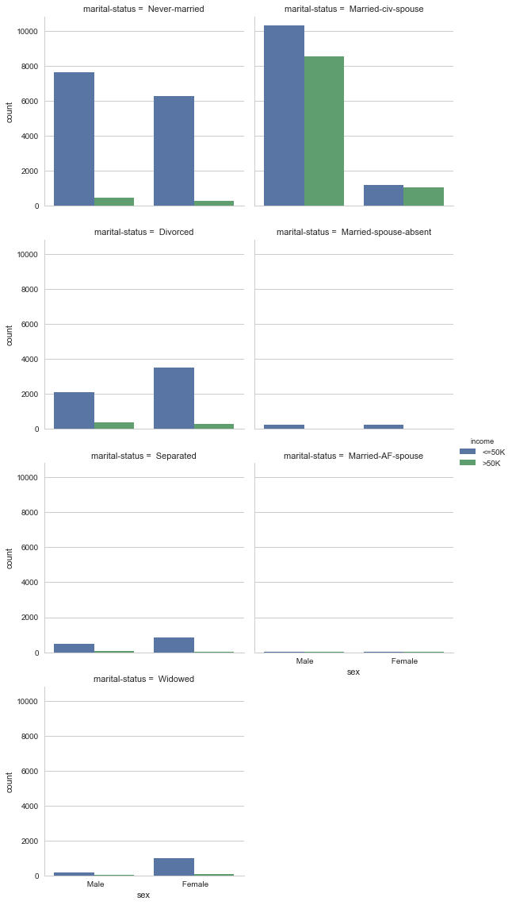
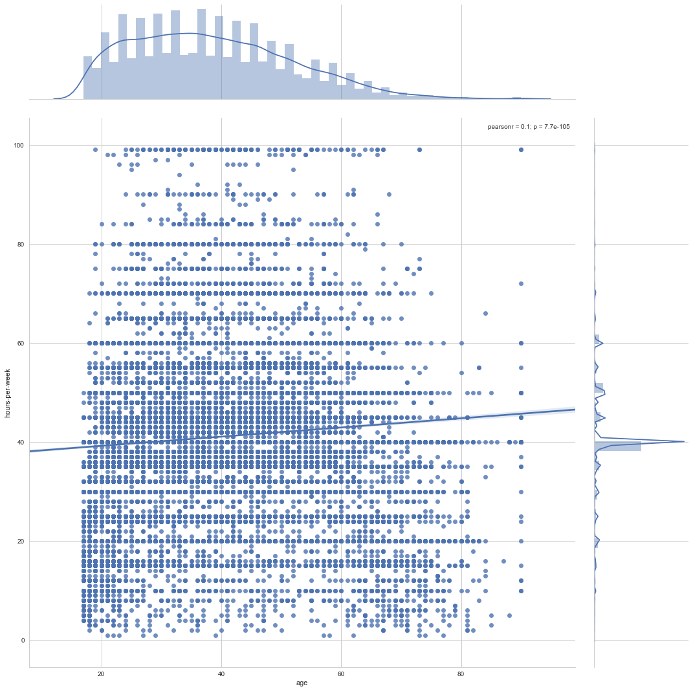
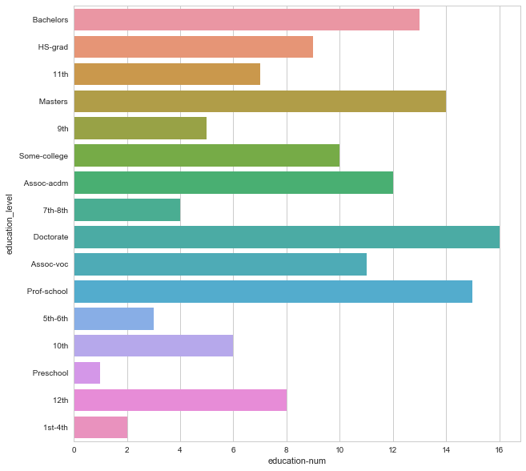

# Data Exploration With Pandas

-------------


```python
import pandas as pd
import numpy as np
import seaborn as sns
import matplotlib.pyplot as plt
%matplotlib inline
sns.set()
```

### Load data


```python
titanic = pd.read_csv('data/titanic.csv')
```

### Setting Name column as index


```python
titanic_df1 = titanic.copy(deep =True)
```


```python
titanic_df1 = titanic.set_index('Name')
titanic_df1.head(2)
```


<div>
<style scoped>
    .dataframe tbody tr th:only-of-type {
        vertical-align: middle;
    }

    .dataframe tbody tr th {
        vertical-align: top;
    }

    .dataframe thead th {
        text-align: right;
    }
</style>
<table border="1" class="dataframe">
  <thead>
    <tr style="text-align: right;">
      <th></th>
      <th>PassengerId</th>
      <th>Survived</th>
      <th>Pclass</th>
      <th>Sex</th>
      <th>Age</th>
      <th>SibSp</th>
      <th>Parch</th>
      <th>Ticket</th>
      <th>Fare</th>
      <th>Cabin</th>
      <th>Embarked</th>
    </tr>
    <tr>
      <th>Name</th>
      <th></th>
      <th></th>
      <th></th>
      <th></th>
      <th></th>
      <th></th>
      <th></th>
      <th></th>
      <th></th>
      <th></th>
      <th></th>
    </tr>
  </thead>
  <tbody>
    <tr>
      <th>Braund, Mr. Owen Harris</th>
      <td>1</td>
      <td>0</td>
      <td>3</td>
      <td>male</td>
      <td>22.0</td>
      <td>1</td>
      <td>0</td>
      <td>A/5 21171</td>
      <td>7.2500</td>
      <td>NaN</td>
      <td>S</td>
    </tr>
    <tr>
      <th>Cumings, Mrs. John Bradley (Florence Briggs Thayer)</th>
      <td>2</td>
      <td>1</td>
      <td>1</td>
      <td>female</td>
      <td>38.0</td>
      <td>1</td>
      <td>0</td>
      <td>PC 17599</td>
      <td>71.2833</td>
      <td>C85</td>
      <td>C</td>
    </tr>
  </tbody>
</table>
</div>


### Data Exploration: Titanic Dataset


```python
titanic_df1.describe()
```


<div>
<style scoped>
    .dataframe tbody tr th:only-of-type {
        vertical-align: middle;
    }

    .dataframe tbody tr th {
        vertical-align: top;
    }

    .dataframe thead th {
        text-align: right;
    }
</style>
<table border="1" class="dataframe">
  <thead>
    <tr style="text-align: right;">
      <th></th>
      <th>PassengerId</th>
      <th>Survived</th>
      <th>Pclass</th>
      <th>Age</th>
      <th>SibSp</th>
      <th>Parch</th>
      <th>Fare</th>
    </tr>
  </thead>
  <tbody>
    <tr>
      <th>count</th>
      <td>891.000000</td>
      <td>891.000000</td>
      <td>891.000000</td>
      <td>714.000000</td>
      <td>891.000000</td>
      <td>891.000000</td>
      <td>891.000000</td>
    </tr>
    <tr>
      <th>mean</th>
      <td>446.000000</td>
      <td>0.383838</td>
      <td>2.308642</td>
      <td>29.699118</td>
      <td>0.523008</td>
      <td>0.381594</td>
      <td>32.204208</td>
    </tr>
    <tr>
      <th>std</th>
      <td>257.353842</td>
      <td>0.486592</td>
      <td>0.836071</td>
      <td>14.526497</td>
      <td>1.102743</td>
      <td>0.806057</td>
      <td>49.693429</td>
    </tr>
    <tr>
      <th>min</th>
      <td>1.000000</td>
      <td>0.000000</td>
      <td>1.000000</td>
      <td>0.420000</td>
      <td>0.000000</td>
      <td>0.000000</td>
      <td>0.000000</td>
    </tr>
    <tr>
      <th>25%</th>
      <td>223.500000</td>
      <td>0.000000</td>
      <td>2.000000</td>
      <td>20.125000</td>
      <td>0.000000</td>
      <td>0.000000</td>
      <td>7.910400</td>
    </tr>
    <tr>
      <th>50%</th>
      <td>446.000000</td>
      <td>0.000000</td>
      <td>3.000000</td>
      <td>28.000000</td>
      <td>0.000000</td>
      <td>0.000000</td>
      <td>14.454200</td>
    </tr>
    <tr>
      <th>75%</th>
      <td>668.500000</td>
      <td>1.000000</td>
      <td>3.000000</td>
      <td>38.000000</td>
      <td>1.000000</td>
      <td>0.000000</td>
      <td>31.000000</td>
    </tr>
    <tr>
      <th>max</th>
      <td>891.000000</td>
      <td>1.000000</td>
      <td>3.000000</td>
      <td>80.000000</td>
      <td>8.000000</td>
      <td>6.000000</td>
      <td>512.329200</td>
    </tr>
  </tbody>
</table>
</div>


```python
plt.figure(figsize = [15,15])
plt.subplot(2,2,1)
plt.xlabel('Sex')
titanic_df1['Sex'].hist()
plt.subplot(2,2,2)
plt.xlabel('Age')
titanic_df1['Age'].hist(bins =50)
plt.subplot(2,2,3)
plt.xlabel('Fare')
titanic_df1['Fare'].hist(bins =50)
plt.subplot(2,2,4)
plt.xlabel('Age')
plt.ylabel('Fare')
plt.scatter(titanic_df1['Age'],titanic_df1['Fare'])
plt.show()
```


---------------

### Data Exploration with Charity Dataset

-------------


```python
charitydf = pd.read_csv('data/charity.csv')
```


```python
charitydf.head()
```


<div>
<style scoped>
    .dataframe tbody tr th:only-of-type {
        vertical-align: middle;
    }

    .dataframe tbody tr th {
        vertical-align: top;
    }

    .dataframe thead th {
        text-align: right;
    }
</style>
<table border="1" class="dataframe">
  <thead>
    <tr style="text-align: right;">
      <th></th>
      <th>age</th>
      <th>workclass</th>
      <th>education_level</th>
      <th>education-num</th>
      <th>marital-status</th>
      <th>occupation</th>
      <th>relationship</th>
      <th>race</th>
      <th>sex</th>
      <th>capital-gain</th>
      <th>capital-loss</th>
      <th>hours-per-week</th>
      <th>native-country</th>
      <th>income</th>
    </tr>
  </thead>
  <tbody>
    <tr>
      <th>0</th>
      <td>39</td>
      <td>State-gov</td>
      <td>Bachelors</td>
      <td>13.0</td>
      <td>Never-married</td>
      <td>Adm-clerical</td>
      <td>Not-in-family</td>
      <td>White</td>
      <td>Male</td>
      <td>2174.0</td>
      <td>0.0</td>
      <td>40.0</td>
      <td>United-States</td>
      <td>&lt;=50K</td>
    </tr>
    <tr>
      <th>1</th>
      <td>50</td>
      <td>Self-emp-not-inc</td>
      <td>Bachelors</td>
      <td>13.0</td>
      <td>Married-civ-spouse</td>
      <td>Exec-managerial</td>
      <td>Husband</td>
      <td>White</td>
      <td>Male</td>
      <td>0.0</td>
      <td>0.0</td>
      <td>13.0</td>
      <td>United-States</td>
      <td>&lt;=50K</td>
    </tr>
    <tr>
      <th>2</th>
      <td>38</td>
      <td>Private</td>
      <td>HS-grad</td>
      <td>9.0</td>
      <td>Divorced</td>
      <td>Handlers-cleaners</td>
      <td>Not-in-family</td>
      <td>White</td>
      <td>Male</td>
      <td>0.0</td>
      <td>0.0</td>
      <td>40.0</td>
      <td>United-States</td>
      <td>&lt;=50K</td>
    </tr>
    <tr>
      <th>3</th>
      <td>53</td>
      <td>Private</td>
      <td>11th</td>
      <td>7.0</td>
      <td>Married-civ-spouse</td>
      <td>Handlers-cleaners</td>
      <td>Husband</td>
      <td>Black</td>
      <td>Male</td>
      <td>0.0</td>
      <td>0.0</td>
      <td>40.0</td>
      <td>United-States</td>
      <td>&lt;=50K</td>
    </tr>
    <tr>
      <th>4</th>
      <td>28</td>
      <td>Private</td>
      <td>Bachelors</td>
      <td>13.0</td>
      <td>Married-civ-spouse</td>
      <td>Prof-specialty</td>
      <td>Wife</td>
      <td>Black</td>
      <td>Female</td>
      <td>0.0</td>
      <td>0.0</td>
      <td>40.0</td>
      <td>Cuba</td>
      <td>&lt;=50K</td>
    </tr>
  </tbody>
</table>
</div>


```python
charitydf.describe()
```


<div>
<style scoped>
    .dataframe tbody tr th:only-of-type {
        vertical-align: middle;
    }

    .dataframe tbody tr th {
        vertical-align: top;
    }

    .dataframe thead th {
        text-align: right;
    }
</style>
<table border="1" class="dataframe">
  <thead>
    <tr style="text-align: right;">
      <th></th>
      <th>age</th>
      <th>education-num</th>
      <th>capital-gain</th>
      <th>capital-loss</th>
      <th>hours-per-week</th>
    </tr>
  </thead>
  <tbody>
    <tr>
      <th>count</th>
      <td>45222.000000</td>
      <td>45222.000000</td>
      <td>45222.000000</td>
      <td>45222.000000</td>
      <td>45222.000000</td>
    </tr>
    <tr>
      <th>mean</th>
      <td>38.547941</td>
      <td>10.118460</td>
      <td>1101.430344</td>
      <td>88.595418</td>
      <td>40.938017</td>
    </tr>
    <tr>
      <th>std</th>
      <td>13.217870</td>
      <td>2.552881</td>
      <td>7506.430084</td>
      <td>404.956092</td>
      <td>12.007508</td>
    </tr>
    <tr>
      <th>min</th>
      <td>17.000000</td>
      <td>1.000000</td>
      <td>0.000000</td>
      <td>0.000000</td>
      <td>1.000000</td>
    </tr>
    <tr>
      <th>25%</th>
      <td>28.000000</td>
      <td>9.000000</td>
      <td>0.000000</td>
      <td>0.000000</td>
      <td>40.000000</td>
    </tr>
    <tr>
      <th>50%</th>
      <td>37.000000</td>
      <td>10.000000</td>
      <td>0.000000</td>
      <td>0.000000</td>
      <td>40.000000</td>
    </tr>
    <tr>
      <th>75%</th>
      <td>47.000000</td>
      <td>13.000000</td>
      <td>0.000000</td>
      <td>0.000000</td>
      <td>45.000000</td>
    </tr>
    <tr>
      <th>max</th>
      <td>90.000000</td>
      <td>16.000000</td>
      <td>99999.000000</td>
      <td>4356.000000</td>
      <td>99.000000</td>
    </tr>
  </tbody>
</table>
</div>


```python
charitydf.info()
```

    <class 'pandas.core.frame.DataFrame'>
    RangeIndex: 45222 entries, 0 to 45221
    Data columns (total 14 columns):
    age                45222 non-null int64
    workclass          45222 non-null object
    education_level    45222 non-null object
    education-num      45222 non-null float64
    marital-status     45222 non-null object
    occupation         45222 non-null object
    relationship       45222 non-null object
    race               45222 non-null object
    sex                45222 non-null object
    capital-gain       45222 non-null float64
    capital-loss       45222 non-null float64
    hours-per-week     45222 non-null float64
    native-country     45222 non-null object
    income             45222 non-null object
    dtypes: float64(4), int64(1), object(9)
    memory usage: 4.8+ MB


```python
import matplotlib.pyplot as plt
plt.figure(figsize = (14,10))

plt.subplot(2,3,1)
plt.title("distribution of age")
charitydf['age'].hist(bins = 100)

plt.subplot(2,3,2)
plt.title("distribution of education-num")
charitydf['education-num'].hist(bins = 40)

plt.subplot(2,3,3)
plt.title("distribution of capital-gain")
charitydf['capital-gain'].hist(bins = 100)

plt.subplot(2,3,4)
plt.title("distribution of hours-per-week")
charitydf['hours-per-week'].hist(bins = 50)

plt.subplot(2,3,5)
plt.title("distribution of capital-loss")
charitydf['capital-loss'].hist(bins = 50)

plt.show()
```


    <matplotlib.axes._subplots.AxesSubplot at 0x7efd84af9358>


```python
plt.figure(figsize = (16,21))
sns.set()
sns.pairplot(charitydf, hue="income")
```


    <seaborn.axisgrid.PairGrid at 0x7efd84b28ba8>


    <matplotlib.figure.Figure at 0x7efd84b197b8>


```python
sns.countplot(y="marital-status", hue="income", data=charitydf, palette="Greens_d");
```


```python
plt.figure(figsize = (16,21))
sns.set(style="whitegrid", color_codes=True)
sns.factorplot("sex", col="marital-status", data=charitydf, 
               hue='income', kind="count", col_wrap=2);

```


    <matplotlib.figure.Figure at 0x7efd860fd9b0>





```python
plt.figure(figsize = (15,21))
plt.subplot(1,2,1)
sns.countplot(y="age", hue="income", data=charitydf, palette="Greens_d");
plt.subplot(1,2,2)
sns.countplot(y="hours-per-week", hue="income", data=charitydf, palette="Greens_d");
```


```python
plt.figure(figsize = (15,21))
sns.jointplot(x="age", y="hours-per-week", data=charitydf,size=15,kind = 'reg');
```


    <matplotlib.figure.Figure at 0x7efd7ee362b0>





```python
plt.figure(figsize = (10,10))
sns.barplot(x="education-num", y="education_level", data=charitydf);
```





```python
plt.figure(figsize = (16,16))
plt.subplot(1,2,1)
sns.countplot(y="education-num", hue="income", data=charitydf, palette="Greens_d");
plt.subplot(1,2,2)
sns.countplot(y="education_level", hue="income", data=charitydf, palette="Greens_d");
```


