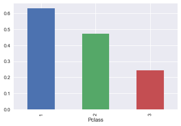
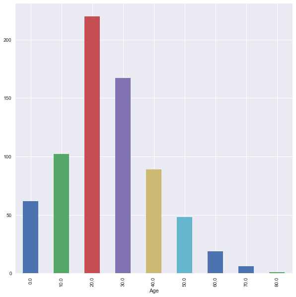
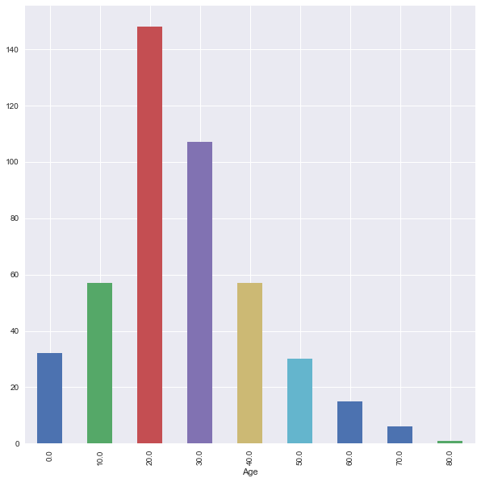

# Data Handeling: Groupby, Merge, Split

-------------


```python
import pandas as pd
import numpy as np
import seaborn as sns
import matplotlib.pyplot as plt
%matplotlib inline
sns.set()
```

#### Load data


```python
titanic = pd.read_csv('data/titanic.csv')
```

### Setting Name column as index


```python
titanic_df1 = titanic.copy(deep =True)
```


```python
titanic_df1 = titanic.set_index('Name')
titanic_df1.head(2)
```


<div>
<style scoped>
    .dataframe tbody tr th:only-of-type {
        vertical-align: middle;
    }

    .dataframe tbody tr th {
        vertical-align: top;
    }

    .dataframe thead th {
        text-align: right;
    }
</style>
<table border="1" class="dataframe">
  <thead>
    <tr style="text-align: right;">
      <th></th>
      <th>PassengerId</th>
      <th>Survived</th>
      <th>Pclass</th>
      <th>Sex</th>
      <th>Age</th>
      <th>SibSp</th>
      <th>Parch</th>
      <th>Ticket</th>
      <th>Fare</th>
      <th>Cabin</th>
      <th>Embarked</th>
    </tr>
    <tr>
      <th>Name</th>
      <th></th>
      <th></th>
      <th></th>
      <th></th>
      <th></th>
      <th></th>
      <th></th>
      <th></th>
      <th></th>
      <th></th>
      <th></th>
    </tr>
  </thead>
  <tbody>
    <tr>
      <th>Braund, Mr. Owen Harris</th>
      <td>1</td>
      <td>0</td>
      <td>3</td>
      <td>male</td>
      <td>22.0</td>
      <td>1</td>
      <td>0</td>
      <td>A/5 21171</td>
      <td>7.2500</td>
      <td>NaN</td>
      <td>S</td>
    </tr>
    <tr>
      <th>Cumings, Mrs. John Bradley (Florence Briggs Thayer)</th>
      <td>2</td>
      <td>1</td>
      <td>1</td>
      <td>female</td>
      <td>38.0</td>
      <td>1</td>
      <td>0</td>
      <td>PC 17599</td>
      <td>71.2833</td>
      <td>C85</td>
      <td>C</td>
    </tr>
  </tbody>
</table>
</div>


-----------

## Group By : ```groupby.aggregate()```, ```groupby.size()```,```groupby.mean()```,

-----------

### The groupby operation (split-apply-combine)

The "group by" concept: we want to **apply the same function on subsets of your dataframe, based on some key to split the dataframe in subsets**

This operation is also referred to as the "split-apply-combine" operation, involving the following steps:

* **Splitting** the data into groups based on some criteria
* **Applying** a function to each group independently
* **Combining** the results into a data structure


```python
df = pd.DataFrame({'key':['A','B','C','A','B','C','A','B','C'],
                   'data': [0, 5, 10, 5, 10, 15, 10, 15, 20]})
df
```


<div>
<style scoped>
    .dataframe tbody tr th:only-of-type {
        vertical-align: middle;
    }

    .dataframe tbody tr th {
        vertical-align: top;
    }

    .dataframe thead th {
        text-align: right;
    }
</style>
<table border="1" class="dataframe">
  <thead>
    <tr style="text-align: right;">
      <th></th>
      <th>key</th>
      <th>data</th>
    </tr>
  </thead>
  <tbody>
    <tr>
      <th>0</th>
      <td>A</td>
      <td>0</td>
    </tr>
    <tr>
      <th>1</th>
      <td>B</td>
      <td>5</td>
    </tr>
    <tr>
      <th>2</th>
      <td>C</td>
      <td>10</td>
    </tr>
    <tr>
      <th>3</th>
      <td>A</td>
      <td>5</td>
    </tr>
    <tr>
      <th>4</th>
      <td>B</td>
      <td>10</td>
    </tr>
    <tr>
      <th>5</th>
      <td>C</td>
      <td>15</td>
    </tr>
    <tr>
      <th>6</th>
      <td>A</td>
      <td>10</td>
    </tr>
    <tr>
      <th>7</th>
      <td>B</td>
      <td>15</td>
    </tr>
    <tr>
      <th>8</th>
      <td>C</td>
      <td>20</td>
    </tr>
  </tbody>
</table>
</div>


```python
df.groupby('key').aggregate(np.sum)
```


<div>
<style scoped>
    .dataframe tbody tr th:only-of-type {
        vertical-align: middle;
    }

    .dataframe tbody tr th {
        vertical-align: top;
    }

    .dataframe thead th {
        text-align: right;
    }
</style>
<table border="1" class="dataframe">
  <thead>
    <tr style="text-align: right;">
      <th></th>
      <th>data</th>
    </tr>
    <tr>
      <th>key</th>
      <th></th>
    </tr>
  </thead>
  <tbody>
    <tr>
      <th>A</th>
      <td>15</td>
    </tr>
    <tr>
      <th>B</th>
      <td>30</td>
    </tr>
    <tr>
      <th>C</th>
      <td>45</td>
    </tr>
  </tbody>
</table>
</div>


### Exercise with Titanic Dataset


```python
titanic_df1.groupby('Sex').size()
```


    Sex
    female    314
    male      577
    dtype: int64


<div class="alert alert-success">
    <b>EXERCISE</b>: Using groupby(), calculate the average age for each sex.
</div>


```python
titanic_df1.groupby('Sex')['Age'].mean()
```


    Sex
    female    27.915709
    male      30.726645
    Name: Age, dtype: float64


----------

<div class="alert alert-success">
    <b>EXERCISE</b>: Calculate the average survival ratio for all passengers.
</div>


```python
titanic_df1['Survived'].sum() / len(titanic_df1['Survived'])
```


    0.3838383838383838


-------------

<div class="alert alert-success">
    <b>EXERCISE</b>: Calculate this survival ratio for all passengers younger that 25 (remember: filtering/boolean indexing).
</div>


```python
df25 = titanic_df1[titanic_df1['Age'] <= 25]
df25['Survived'].sum() / len(df25['Survived'])
```


    0.4119601328903654


-----------

<div class="alert alert-success">
    <b>EXERCISE</b>: Is there a difference in this survival ratio between the sexes? (tip: write the above calculation of the survival ratio as a function)
</div>


```python
def survival_ratio(survived):
    return survived.sum() / len(survived)
```


```python
titanic_df1.groupby('Sex')['Survived'].aggregate(survival_ratio)
```


    Sex
    female    0.742038
    male      0.188908
    Name: Survived, dtype: float64


-----------

<div class="alert alert-success">
    <b>EXERCISE</b>: Make a bar plot of the survival ratio for the different classes ('Pclass' column).
</div>


```python
titanic_df1.groupby('Pclass')['Survived'].aggregate(survival_ratio).plot(kind='bar')
```


    <matplotlib.axes._subplots.AxesSubplot at 0x7fb321d163c8>





## Advanced Groupby Operations

<div class="alert alert-success">
    <b>EXERCISE</b>: Find data for age distribution.
</div>


```python
type(10//2)
```


    int


```python
df = titanic_df1.copy(deep =True)
```


```python
df.groupby(df.Age//10 * 10).size().plot(kind='bar',figsize = [10,10])
```


    <matplotlib.axes._subplots.AxesSubplot at 0x7fb31d63f2b0>





<div class="alert alert-success">
    <b>EXERCISE</b>: Find data for male age distribution.
</div>


```python
Male = df[df['Sex'] == 'male']
Male.groupby(Male.Age // 10 * 10).size().plot(kind='bar',figsize = [10,10])
```


    <matplotlib.axes._subplots.AxesSubplot at 0x7fb31d524dd8>





<div class="alert alert-success">
    <b>EXERCISE</b>: List data with Fare size greater then 50.
</div>


```python
Fare50 = df[df.Fare>50]
Fare50.groupby([ 'Sex']).size()
```


    Sex
    female    87
    male      73
    dtype: int64


```python
Fare50.groupby(['Age', 'Sex','Survived']).size()
```


    Age    Sex     Survived
    0.92   male    1           1
    2.00   female  0           1
    4.00   male    1           1
    11.00  male    1           1
    14.00  female  1           1
    15.00  female  1           1
    16.00  female  1           2
    17.00  female  1           2
           male    1           1
    18.00  female  1           3
           male    0           2
    19.00  female  1           1
           male    0           2
    21.00  female  1           2
           male    0           3
    22.00  female  1           3
           male    0           1
    23.00  female  1           2
           male    1           1
    24.00  female  1           5
           male    0           3
    25.00  female  0           1
           male    1           2
    26.00  female  1           1
           male    1           1
    27.00  male    0           1
                   1           2
    28.00  male    0           2
    29.00  female  1           1
           male    0           1
                              ..
    45.00  female  1           1
           male    0           1
    46.00  male    0           2
    47.00  female  1           1
           male    0           1
    48.00  female  1           1
           male    1           2
    49.00  female  1           1
           male    0           1
                   1           2
    50.00  female  1           1
           male    0           2
                   1           1
    51.00  female  1           1
           male    0           1
    52.00  female  1           2
           male    0           1
    53.00  female  1           1
    54.00  female  1           2
           male    0           2
    56.00  female  1           1
    58.00  female  1           2
           male    0           1
    60.00  female  1           1
           male    1           1
    62.00  female  1           1
    63.00  female  1           1
    64.00  male    0           1
    65.00  male    0           1
    70.00  male    0           1
    Length: 87, dtype: int64


------------

## Group by followed by Transformation: ```groupby.transform()```


```python
df = pd.DataFrame({'key':['A','B','C','A','B','C','A','B','C'],
                   'data': [0, 5, 10, 5, 10, 15, 10, 15, 20]})
df
```


<div>
<style scoped>
    .dataframe tbody tr th:only-of-type {
        vertical-align: middle;
    }

    .dataframe tbody tr th {
        vertical-align: top;
    }

    .dataframe thead th {
        text-align: right;
    }
</style>
<table border="1" class="dataframe">
  <thead>
    <tr style="text-align: right;">
      <th></th>
      <th>data</th>
      <th>key</th>
    </tr>
  </thead>
  <tbody>
    <tr>
      <th>0</th>
      <td>0</td>
      <td>A</td>
    </tr>
    <tr>
      <th>1</th>
      <td>5</td>
      <td>B</td>
    </tr>
    <tr>
      <th>2</th>
      <td>10</td>
      <td>C</td>
    </tr>
    <tr>
      <th>3</th>
      <td>5</td>
      <td>A</td>
    </tr>
    <tr>
      <th>4</th>
      <td>10</td>
      <td>B</td>
    </tr>
    <tr>
      <th>5</th>
      <td>15</td>
      <td>C</td>
    </tr>
    <tr>
      <th>6</th>
      <td>10</td>
      <td>A</td>
    </tr>
    <tr>
      <th>7</th>
      <td>15</td>
      <td>B</td>
    </tr>
    <tr>
      <th>8</th>
      <td>20</td>
      <td>C</td>
    </tr>
  </tbody>
</table>
</div>


```python
df.groupby('key').transform('mean')
```


<div>
<style scoped>
    .dataframe tbody tr th:only-of-type {
        vertical-align: middle;
    }

    .dataframe tbody tr th {
        vertical-align: top;
    }

    .dataframe thead th {
        text-align: right;
    }
</style>
<table border="1" class="dataframe">
  <thead>
    <tr style="text-align: right;">
      <th></th>
      <th>data</th>
    </tr>
  </thead>
  <tbody>
    <tr>
      <th>0</th>
      <td>5</td>
    </tr>
    <tr>
      <th>1</th>
      <td>10</td>
    </tr>
    <tr>
      <th>2</th>
      <td>15</td>
    </tr>
    <tr>
      <th>3</th>
      <td>5</td>
    </tr>
    <tr>
      <th>4</th>
      <td>10</td>
    </tr>
    <tr>
      <th>5</th>
      <td>15</td>
    </tr>
    <tr>
      <th>6</th>
      <td>5</td>
    </tr>
    <tr>
      <th>7</th>
      <td>10</td>
    </tr>
    <tr>
      <th>8</th>
      <td>15</td>
    </tr>
  </tbody>
</table>
</div>


```python
def normalize(group):
    return (group - group.mean()) / group.std()
```


```python
df.groupby('key').transform(normalize)
```


<div>
<style scoped>
    .dataframe tbody tr th:only-of-type {
        vertical-align: middle;
    }

    .dataframe tbody tr th {
        vertical-align: top;
    }

    .dataframe thead th {
        text-align: right;
    }
</style>
<table border="1" class="dataframe">
  <thead>
    <tr style="text-align: right;">
      <th></th>
      <th>data</th>
    </tr>
  </thead>
  <tbody>
    <tr>
      <th>0</th>
      <td>-1.0</td>
    </tr>
    <tr>
      <th>1</th>
      <td>-1.0</td>
    </tr>
    <tr>
      <th>2</th>
      <td>-1.0</td>
    </tr>
    <tr>
      <th>3</th>
      <td>0.0</td>
    </tr>
    <tr>
      <th>4</th>
      <td>0.0</td>
    </tr>
    <tr>
      <th>5</th>
      <td>0.0</td>
    </tr>
    <tr>
      <th>6</th>
      <td>1.0</td>
    </tr>
    <tr>
      <th>7</th>
      <td>1.0</td>
    </tr>
    <tr>
      <th>8</th>
      <td>1.0</td>
    </tr>
  </tbody>
</table>
</div>


```python
df.groupby('key').transform('sum')
```


<div>
<style scoped>
    .dataframe tbody tr th:only-of-type {
        vertical-align: middle;
    }

    .dataframe tbody tr th {
        vertical-align: top;
    }

    .dataframe thead th {
        text-align: right;
    }
</style>
<table border="1" class="dataframe">
  <thead>
    <tr style="text-align: right;">
      <th></th>
      <th>data</th>
    </tr>
  </thead>
  <tbody>
    <tr>
      <th>0</th>
      <td>15</td>
    </tr>
    <tr>
      <th>1</th>
      <td>30</td>
    </tr>
    <tr>
      <th>2</th>
      <td>45</td>
    </tr>
    <tr>
      <th>3</th>
      <td>15</td>
    </tr>
    <tr>
      <th>4</th>
      <td>30</td>
    </tr>
    <tr>
      <th>5</th>
      <td>45</td>
    </tr>
    <tr>
      <th>6</th>
      <td>15</td>
    </tr>
    <tr>
      <th>7</th>
      <td>30</td>
    </tr>
    <tr>
      <th>8</th>
      <td>45</td>
    </tr>
  </tbody>
</table>
</div>


