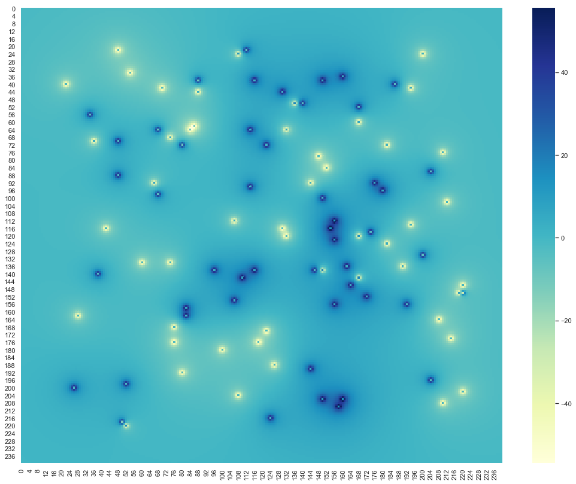

# Project: N-charge system

$$ E = q * \frac{\hat{r}}{r}$$

$$ V  = q * \frac{1}{r}$$

$$ V  = q * \frac{1}{\sqrt{((x-x^{'})^{2} + (y - y^{'})^{2})}} $$


```python
import matplotlib.pyplot as plt
from matplotlib import cm
% matplotlib inline
import seaborn as sns
sns.set()
```

#### Class Charge


```python
class Charge:
    
    '''Data incapsulation'''
    def __init__(self, q, pos):
        self.q = q
        self.pos = pos
        
        
    def line(self, x,y):
        '''create a vector from charge to observation point'''
        self.vector = [x-self.pos[0],y-self.pos[1]]
        '''norm of the vector'''
        self.norm = np.sqrt((self.vector[0])**2+(self.vector[1])**2)
        
    
    def V_point_charge(self, x, y):
        '''recall length'''
        self.line(x,y)
        '''Make sure to exclude source itself'''
        if self.norm >0:
            self.V = self.q/self.norm
            
            '''if length is zero, set V equal to 0'''
        else:
            self.V = 0
        return self.V
    
```

#### Example :  

Lets use charge q = 100 at posiotion x =5 and y =5 to find electric potential at different points in 2D


```python
C = Charge(100, [5,5])
```


```python
for x in range(10):
    for y in range(10):
        print(x,y, "|", C.V_point_charge(x, y))
```

    0 0 | 5.652334189442215
    0 1 | 5.892556509887896
    0 2 | 6.142951168339512
    0 3 | 6.401843996644799
    0 4 | 6.666666666666667
    0 5 | 6.933752452815364
    0 6 | 7.198157507486946
    0 7 | 7.453559924999299
    0 8 | 7.6923076923076925
    0 9 | 7.905694150420948
    1 0 | 5.872202195147034
    1 1 | 6.142951168339512
    1 2 | 6.42824346533225
    1 3 | 6.726727939963125
    1 4 | 7.035975447302919
    1 5 | 7.352146220938077
    1 6 | 7.669649888473704
    1 7 | 7.9808688446762215
    1 8 | 8.27605888602368
    1 9 | 8.54357657716761
    2 0 | 6.097107608496923
    2 1 | 6.401843996644799
    2 2 | 6.726727939963125
    2 3 | 7.071067811865475
    2 4 | 7.432941462471663
    2 5 | 7.808688094430304
    2 6 | 8.192319205190405
    2 7 | 8.574929257125442
    2 8 | 8.94427190999916
    2 9 | 9.284766908852594
    3 0 | 6.324555320336759
    3 1 | 6.666666666666667
    3 2 | 7.035975447302919
    3 3 | 7.432941462471663
    3 4 | 7.856742013183862
    3 5 | 8.304547985373997
    3 6 | 8.770580193070293
    3 7 | 9.245003270420485
    3 8 | 9.712858623572641
    3 9 | 10.15346165133619
    4 0 | 6.551217820804184
    4 1 | 6.933752452815364
    4 2 | 7.352146220938077
    4 3 | 7.808688094430304
    4 4 | 8.304547985373997
    4 5 | 8.838834764831843
    4 6 | 9.407208683835972
    4 7 | 10.0
    4 8 | 10.599978800063601
    4 9 | 11.180339887498947
    5 0 | 6.772854614785964
    5 1 | 7.198157507486946
    5 2 | 7.669649888473704
    5 3 | 8.192319205190405
    5 4 | 8.770580193070293
    5 5 | 9.407208683835972
    5 6 | 10.101525445522107
    5 7 | 10.846522890932809
    5 8 | 11.624763874381928
    5 9 | 12.403473458920846
    6 0 | 6.984302957695782
    6 1 | 7.453559924999299
    6 2 | 7.9808688446762215
    6 3 | 8.574929257125442
    6 4 | 9.245003270420485
    6 5 | 10.0
    6 6 | 10.846522890932809
    6 7 | 11.785113019775793
    6 8 | 12.803687993289598
    6 9 | 13.867504905630728
    7 0 | 7.179581586177381
    7 1 | 7.6923076923076925
    7 2 | 8.27605888602368
    7 3 | 8.94427190999916
    7 4 | 9.712858623572641
    7 5 | 10.599978800063601
    7 6 | 11.624763874381928
    7 7 | 12.803687993289598
    7 8 | 14.14213562373095
    7 9 | 15.617376188860607
    8 0 | 7.352146220938077
    8 1 | 7.905694150420948
    8 2 | 8.54357657716761
    8 3 | 9.284766908852594
    8 4 | 10.15346165133619
    8 5 | 11.180339887498947
    8 6 | 12.403473458920846
    8 7 | 13.867504905630728
    8 8 | 15.617376188860607
    8 9 | 17.677669529663685
    9 0 | 7.495316889958614
    9 1 | 8.084520834544433
    9 2 | 8.770580193070293
    9 3 | 9.578262852211514
    9 4 | 10.540925533894598
    9 5 | 11.704114719613058
    9 6 | 13.130643285972255
    9 7 | 14.907119849998598
    9 8 | 17.149858514250884
    9 9 | 20.0


#### Total Electric potential


```python
def V_total(x, y, charges):
    V = 0
    for C in charges:
        Vp = C.V_point_charge(x, y)
        V  = V+Vp
    return V
```

##### Example: 

Lets use collection of charges to find a electric potential at point x = 4, y =4


```python
sample_charges = [Charge(q = 20, pos = [23,34]),
                  Charge(q = 25, pos = [13,48]),
                  Charge(q = 40, pos = [3,14]),
                  Charge(q = 80, pos = [88,60])]


V_total(x=4, y=4, charges = sample_charges)
```


    5.892446541150622


### Implementation - 1 : Lattice of charges


```python
'''first charge to be at x=1,y=1'''
q = 100

'''Dictionary to collect charges, x and y xoordinates'''
Qd = []

'''List to collect Charge objects'''
charges = []


'''use for loops to construct collection of charges objects'''
for i in range(5):
    for j in range(5):
        
        '''Collecting charges and their coordinates'''
        Qd.append({"q": q, "x": i*20, "y":j*20})
        
        
        '''charge objects are being collected'''
        charges.append(Charge(q , [20*i, 20*j]))
        
        '''change the sign of charge alternatly'''
        q = -q
  
```


```python
import json
with open ('data/charg-lattice.json', 'w')as f1:
    json.dump(Qd,f1)
```

#### Plot of lattice of charges


```python
'''Plot the lattice of charges'''

plt.figure(figsize = [10,8])

for item in Qd:
    
    '''Sctaeer as red dot if charge is positive'''
    if item['q']> 0:
        plt.scatter(item['x'], item['y'], c = 'r')
        
        
        '''Scatter as blue dot if charge is negative'''
    else:
        plt.scatter(item['x'], item['y'], c = 'b')
        
plt.savefig('plot/charge-lattice.pdf')           
plt.show()
```


#### Find Electric Potential


```python
'''Create X and Y coordinate'''
X = np.arange(-10,110,1)
Y = np.arange(-10,110,1)

'''Initiate vacant V-list of list'''
V = [[0.0 for i in range(len(X))] for j in range(len(Y))]

'''Calculate Electric potential at each x,y coordinate'''
for i,x in enumerate(X):
    for j,y in enumerate(Y):
        v = V_total(x, y, charges)
        V[i][j] = v       
```


```python
VV = np.array(V)
```

#### Save electric potential data


```python
import json
with open ('data/potential-lattice.json', 'w')as f2:
    json.dump(V,f2)
```

##### Plot Electric potential


```python
plt.figure(figsize = [18,14])
sns.heatmap(VV,annot=False,cmap='YlGnBu')
plt.savefig('plot/potential-lattice.png')  
plt.show()
```


### Implementation - 2 : Random Charges


```python
import random as random
```


```python
'''first charge to be at x=1,y=1'''
q = 20

'''Dictionary to collect charges, x and y xoordinates'''
Qd = []

'''List to collect Charge objects'''
charges = []


'''use for loops to construct collection of charges objects'''
for i in range(10):
    for j in range(10):
        
        rx = random.randint(1,100)
        ry = random.randint(1,100)
        
        '''collecting charges and their coordinates'''
        Qd.append({"q": q, "x": rx, "y":ry})
        
        
        '''charge objects are being collected'''
        charges.append(Charge(q , [rx,ry]))
        
        '''change the sign of charge alternatly'''
        q = -q
```

##### Save charge configuration


```python
import json
with open ('data/charg-random.json', 'w')as f3:
    json.dump(Qd,f3)
```

##### Plot charge system


```python
'''Plot the lattice of charges'''

plt.figure(figsize = [10,8])

for item in Qd:
    
    '''Sctaeer as red dot if charge is positive'''
    if item['q']> 0:
        plt.scatter(item['x'], item['y'], c = 'r')
        
        
        '''Scatter as blue dot if charge is negative'''
    else:
        plt.scatter(item['x'], item['y'], c = 'b')
plt.savefig('plot/charge-random.pdf')      
plt.show()
```


##### Calculate electric potential


```python
'''Create X and Y coordinate'''
X = np.arange(-10,110,1)
Y = np.arange(-10,110,1)

'''Initiate vacant V-list of list'''
V = [[0.0 for i in range(len(X))] for j in range(len(Y))]

'''Calculate Electric potential at each x,y coordinate'''
for i,x in enumerate(X):
    for j,y in enumerate(Y):
        v = V_total(x, y, charges)
        V[i][j] = v       
```

##### Save electric potential dta


```python
import json
with open ('data/potential-random.json', 'w')as f4:
    json.dump(V,f4)
```

##### Plot potential


```python
V = np.array(V)
```


```python
plt.figure(figsize = [18,14])
sns.heatmap(V,annot=False,cmap='YlGnBu')
plt.savefig('plot/potential-random.pdf')  
plt.show()
```


#### Much finner


```python
'''Create X and Y coordinate'''
X = np.arange(-10,110,0.5)
Y = np.arange(-10,110,0.5)

'''Initiate vacant V-list of list'''
V = [[0.0 for i in range(len(X))] for j in range(len(Y))]

'''Calculate Electric potential at each x,y coordinate'''
for i,x in enumerate(X):
    for j,y in enumerate(Y):
        v = V_total(x, y, charges)
        V[i][j] = v       
```


```python
V = np.array(V)
```


```python
plt.figure(figsize = [18,14])
sns.heatmap(V,annot=False,cmap='YlGnBu')
plt.savefig('plot/potential-random.pdf')  
plt.show()
```





------------
