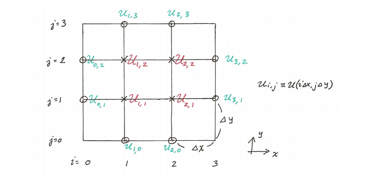
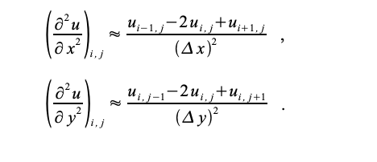

## Numerical Methods: 

1. Integration
4. Differential Equations

### Integration [source](https://docs.scipy.org/doc/scipy/reference/tutorial/integrate.html)


```python
import numpy as np
from scipy.integrate import quad, dblquad, tplquad
```

$$ y = mx +c$$


```python
def f(x):
    return 5*x + 4

x_lower = 0 # the lower limit of x
x_upper = 1 # the upper limit of x

val, abserr = quad(f, x_lower, x_upper)
print("integral value =", val, ", absolute error =", abserr)
```

    integral value = 6.499999999999999 , absolute error = 7.216449660063516e-14


##### Bessel function


```python
from scipy.special import jn, yn, jn_zeros, yn_zeros
```


```python
def integrand(x, n):

    """
    Bessel function of first kind and order n.
    """
    return jn(n, x)

x_lower = 0 # the lower limit of x
x_upper = 10 # the upper limit of x
val, abserr = quad(integrand, x_lower, x_upper, args=(3,))

print(val, abserr)
```

    0.7366751370811073 9.389126882496403e-13


##### Gaussian function


```python
val, abserr = quad(lambda x: np.exp(-x ** 2), -5.0, 5.0)
print("numerical =", val, abserr)
analytical = np.sqrt(np.pi)
print("analytical =", analytical)
```

    numerical = 1.7724538509027912 4.6261378229003154e-14
    analytical = 1.7724538509055159


```python
def integrand(x, y):
    return np.exp(-x**2-y**2)

x_lower = 0
x_upper = 10
y_lower = 0
y_upper = 10

val, abserr = dblquad(integrand, x_lower, x_upper,\
                      lambda x : y_lower, lambda x: y_upper)
print(val, abserr)
```

    0.7853981633974476 1.3753098510218528e-08


### Ordinary Differential Equations [Source](https://docs.scipy.org/doc/scipy/reference/tutorial/integrate.html)


Odent [Source](https://docs.scipy.org/doc/scipy/reference/generated/scipy.integrate.odeint.html#scipy.integrate.odeint)


```python
from scipy.integrate import odeint, ode
```


```python
def dy(y, t, zeta, w0):

    """
    The right-hand side of the damped oscillator ODE
    """
    x, p = y[0], y[1]
    dx = p
    dp = -2 * zeta * w0 * p - w0**2 * x
    return [dx, dp]
```


```python
# initial state:
y0 = [1.0, 0.0]
```


```python
# time coodinate to solve the ODE for
t = np.linspace(0, 10, 1000)
w0 = 2*np.pi*1.0
```


```python
# solve the ODE problem for three different values of the damping ratio
y1 = odeint(dy, y0, t, args=(0.0, w0)) # undamped
y2 = odeint(dy, y0, t, args=(0.2, w0)) # under damped
y3 = odeint(dy, y0, t, args=(1.0, w0)) # critial damping
y4 = odeint(dy, y0, t, args=(5.0, w0)) # over damped
```


```python
plt.figure(figsize = [10,8])
plt.plot(t, y1[:,0], 'k', label="undamped", linewidth=0.25)
plt.plot(t, y2[:,0], 'r', label="under damped")
plt.plot(t, y3[:,0], 'b', label=r"critical damping")
plt.plot(t, y4[:,0], 'g', label="over damped")
plt.legend();
```


### Partial Differential Equations

#### PDE : Eliptic Equation (Laplace Euation)

$$ \nabla^{2} u  + c f(u) = 0 $$

$$\frac{\partial^{2}u}{\partial^{2}x} + \frac{\partial^{2}u}{\partial^{2}x} + cf(u) = 0$$

for $c=1, f(u)=0$ it becomes Laplace Equation



Using Above lattice of finite difference:



$$\large{u_{i−1,j}+u_{i+1,j} + u_{i,j−1} + u{i,j+1} − 4u_{i,j}+cf(u_{i,j})=0}$$

$$u_{i,j}=0;  \forall u \in ∂Ω$$


for 4 by 4 lattice view matrices here: [source](http://folk.ntnu.no/leifh/teaching/tkt4140/._main055.html)


-----

Problem Type : Solve

$$\large{Ax = b}$$

-------

#### Implementation of [Least square methods](https://docs.scipy.org/doc/scipy/reference/generated/scipy.optimize.least_squares.html#scipy.optimize.least_squares) to solve a $Ax = b$ problem as a optimization problem


```python
%matplotlib inline
import matplotlib.pyplot as plt
import numpy as np
from scipy.optimize import least_squares
from scipy.sparse import coo_matrix
import seaborn as sns
sns.set()
```


```python
n = 100
c = 1
```


```python
def f(u):
    return u**3

def f_prime(u):
    return 3 * u**2
```

#### Prepare the lattice


```python
def fun(u, n,f, f_prime,c, **kwargs):
    v = np.zeros((n + 2, n + 2))
    
    #buttom value = 1
    v[n+1,:] = 1
    # top value = 1
    #v[0,:] = 1
    # center value = 1
    #v[int(n/2),int(n/2)] = 1
    
    
    u = u.reshape((n, n))
    v[1:-1, 1:-1] = u
    y = v[:-2, 1:-1] + v[2:, 1:-1] + \
        v[1:-1, :-2] + v[1:-1, 2:] - \
        4 * u + c * f(u)
    return y.ravel()
```

#### Prepare Jacobians


```python
def compute_jac_indices(n):
    i = np.arange(n)
    jj, ii = np.meshgrid(i, i)

    ii = ii.ravel()
    jj = jj.ravel()

    ij = np.arange(n**2)

    jac_rows = [ij]
    jac_cols = [ij]

    mask = ii > 0
    ij_mask = ij[mask]
    jac_rows.append(ij_mask)
    jac_cols.append(ij_mask - n)

    mask = ii < n - 1
    ij_mask = ij[mask]
    jac_rows.append(ij_mask)
    jac_cols.append(ij_mask + n)

    mask = jj > 0
    ij_mask = ij[mask]
    jac_rows.append(ij_mask)
    jac_cols.append(ij_mask - 1)

    mask = jj < n - 1
    ij_mask = ij[mask]
    jac_rows.append(ij_mask)
    jac_cols.append(ij_mask + 1)

    return np.hstack(jac_rows), np.hstack(jac_cols)

```


```python
jac_rows, jac_cols = compute_jac_indices(n)
```


```python
jac_rows, jac_cols
```


    (array([   0,    1,    2, ..., 9996, 9997, 9998]),
     array([   0,    1,    2, ..., 9997, 9998, 9999]))


```python
def jac(u, n,f, f_prime,c, jac_rows=None, jac_cols=None):
    jac_values = np.ones_like(jac_cols, dtype=float)
    jac_values[:n**2] = -4 +  c * f_prime(u)
    return coo_matrix((jac_values, (jac_rows, jac_cols)), shape=(n**2, n**2))

```


```python
u0 = np.ones(n**2) * 0.5
```

#### [Optimization: Least Square](https://docs.scipy.org/doc/scipy/reference/generated/scipy.optimize.least_squares.html#scipy.optimize.least_squares)


```python
res_1 = least_squares(fun, u0, jac=jac, gtol=1e-3, args=(n,f, f_prime,c),\
                      kwargs={'jac_rows': jac_rows, 'jac_cols': jac_cols}, verbose=1)
```

    `gtol` termination condition is satisfied.
    Function evaluations 738, initial cost 1.1562e+02, final cost 6.4462e-01, first-order optimality 9.38e-04.


#### Returned quantities after solution


```python
res_1.x.shape
```


    (10000,)


```python
res_1.x
```


    array([0.00622038, 0.01236634, 0.01833963, ..., 0.01834064, 0.01236645,
           0.00622026])


```python
res_1.fun
```


    array([-0.00014825, -0.00029118, -0.00041394, ..., -0.000414  ,
           -0.00029121, -0.00014826])


```python
res_1.fun.shape
```


    (10000,)


```python
res_1.jac
```


    <10000x10000 sparse matrix of type '<class 'numpy.float64'>'
    	with 49600 stored elements in Compressed Sparse Row format>


#### Plot the solutions


```python
plt.figure(figsize=(16, 5))

plt.subplot(131)
plt.plot(res_1.x)


plt.subplot(132)
plt.imshow(res_1.x.reshape((n, n)),\
           cmap='coolwarm',\
           vmin=-max(abs(res_1.x)),\
           vmax=max(abs(res_1.x)))

plt.colorbar(use_gridspec=True,\
             fraction=0.046,\
             pad=0.04)


plt.subplot(133)
plt.plot(res_1.fun)


plt.tight_layout()
```


### References:
1. http://folk.ntnu.no/leifh/teaching/tkt4140/._main000.html
2. http://folk.ntnu.no/leifh/teaching/tkt4140/._main055.html
3. https://docs.scipy.org/doc/scipy/reference/generated/scipy.optimize.least_squares.html#scipy.optimize.least_squares
