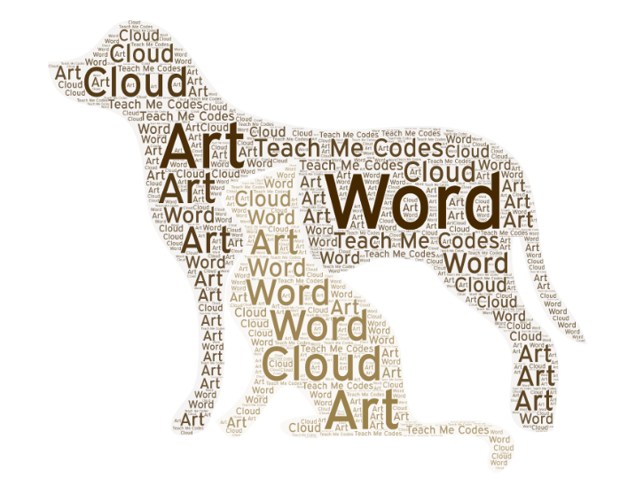

## TeachMe.Codes

This online document helps the absolute beginners to persue the future direction in coding and machine learning. The lesson starts with how to write code in Python along with fundamental ideas in data structure, function and class, Numpy, Pandas and some projects in Machine Learning (Linear Model, Classifiers e.g., Logistic regression, trees, svm, ensamble).

 

        
### Index 

- Why Codes?

- Getting started
      - Guide to starting Python
      - Guide to Python Libraries

- Introduction to Programming
    - [Fundamental DataStructure](www.teachmex.github.io/docs/DataStructure/ds/) 
    - [Loops and Condition](www.teachmex.github.io/docs/LoopsConditions/lnc/)
    - [Function and Class](www.teachmex.github.io/docs//FunctionClass/fnc/)
    - Input-Output
    

- Projects
    - [Project Fern](www.teachmex.github.io/docs/Projects/Fern/fern/)
    - [Project Random Walk](www.teachmex.github.io/docs/Projects/Rwalk/Rwalk/)
    - [Project N-charges](www.teachmex.github.io/docs/Projects/Ncharges/Ncharges/)
    - [Project Diffusion](www.teachmex.github.io/docs/Projects/Diffusion/Diffusion/)

- Numpy
      - Array and ND Array
      - Product and Tensor Product
      - Grid and MeshGrid
      - Linear Algebra
      - Statistics
 
- Scipy
      - Integration
      - Differential Equations
      - Optimization
      - Roots
      - Interpolation
      - Fitting
      
- Pandas
      - Dataframe
      - Indexing
      - Data Exploration
      - GroupBy
      - Lambda Transform      
      
- Basic Visualization
      - Matplotlib
      - Seaborn
      - Pandas
      - Bohek
      - Plotly
      

  

-----------

Prepared by: [TeachMe.Codes](www.teachme.codes)

------
  