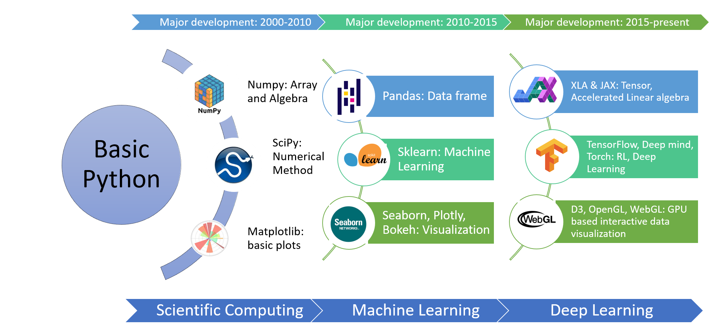

## Python Fundamentals

This online document helps the absolute beginners to persue the future direction in coding and machine learning. The lesson starts with how to write code in Python along with fundamental ideas in data structure, function and class, input output, error handling, Python Standard Library and associated projects.

 

Current days scenarios in computing resources in Python.

## Why Codes?

Codes are apparently the language for Human-Machine interface. Coding is the most fundamental skill required for growing with modern days technology. Sicen our computers are built up based on logic and algorithm, our coding languages are also higher lavel of logical steps made undersatndable for human. By typing a line of code, we are speaking the laguage of the machine.

Fundamentally, each programming language has it's inner working principle with underlying datastructure and functions. Computer while running a piece of code maintains the data in the memory ( temporary at RAM or permanent at Hard Disk). Whil code is live in the machine, it has time and space complexicities with the underlying datastructure and algotihm excuting the task.

